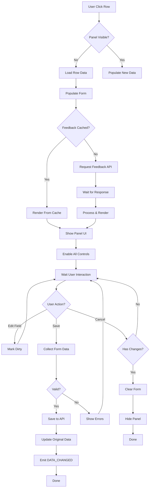
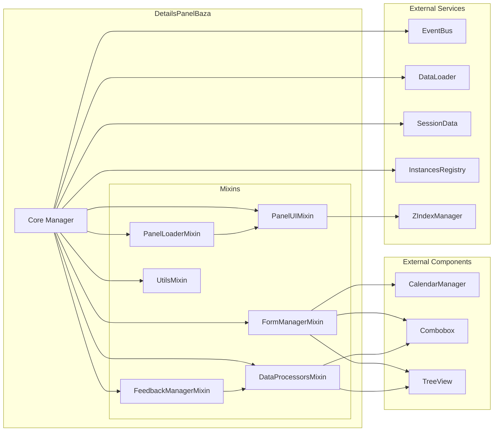
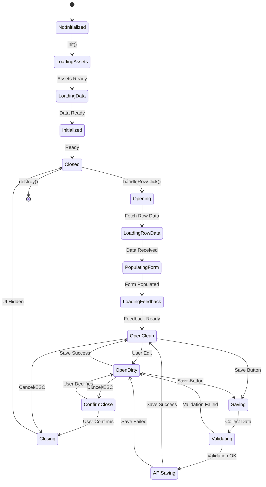
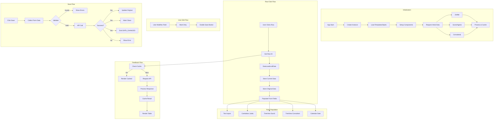
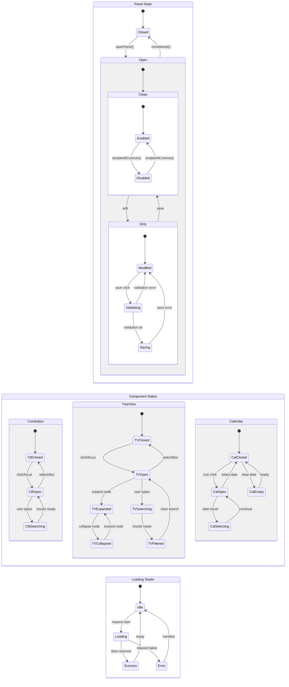

# Details Panel Baza - Documentație Comprehensivă

## 📋 Cuprins

1. [Overview & Scop](#overview--scop)
2. [Arhitectura Modulară](#arhitectura-modulară)
3. [Structura Componentelor](#structura-componentelor)
4. [Ciclul de Viață & Data Flow](#ciclul-de-viață--data-flow)
5. [Dependențe & Componente Externe](#dependențe--componente-externe)
6. [Event Flow Complet](#event-flow-complet)
7. [State Management](#state-management)
8. [Configurare & Setup](#configurare--setup)
9. [API Public](#api-public)
10. [Dezvoltări Viitoare](#dezvoltări-viitoare)
11. [Diagrame Tehnice](#diagrame-tehnice)

---

## Overview & Scop

**Details Panel Baza** este un panel modal/footer pentru editarea și vizualizarea înregistrărilor din tabelul principal (dashboard). Se deschide la click pe un rând din tabel și permite:

- Editare date client (nume, CNP, telefon, email, județ)
- Selecție consultant și sursă lead prin TreeView ierarhic
- Gestionare date și oră primire
- Vizualizare feedback istoric
- Validare și salvare modificări

### Caracteristici Principale

- **Singleton Pattern**: O singură instanță activă
- **Arhitectură Modulară**: 6 mixin-uri specializate
- **Component Integration**: CalendarManager, Combobox, TreeView
- **Cache Management**: Feedback cu expirare automată
- **Loading States**: Feedback vizual pentru operațiuni async
- **Modal/Footer Modes**: Suport pentru ambele moduri (footer planned)

---

## Arhitectura Modulară

Panelul folosește o arhitectură bazată pe **mixin-uri** pentru separarea responsabilităților:

```
DetailsPanelBaza (Core)
├── PanelLoaderMixin        → Template & Style loading, Loading states
├── FeedbackManagerMixin    → Feedback loading, Cache management
├── UtilsMixin              → Helper functions, Formatare date
├── FormManagerMixin        → Form setup, Populare, Validare, Colectare date
├── PanelUIMixin            → Modal/Overlay management, Animations
└── DataProcessorsMixin     → Processing date externe (județe, surse, consultanți)
```

### Responsabilități pe Mixin

| Mixin                    | Responsabilitate Principală   | Metode Cheie                                                                     |
| ------------------------ | ----------------------------- | -------------------------------------------------------------------------------- |
| **PanelLoaderMixin**     | Încărcare assets & loading UI | `loadPanelTemplate()`, `setElementLoadingState()`                                |
| **FeedbackManagerMixin** | Gestionare feedback & cache   | `loadFeedback()`, `renderFeedbackTable()`, `cacheFeedback()`                     |
| **UtilsMixin**           | Funcții helper generale       | `formatDate()`, `cleanAccessRichText()`, `stripHtmlForTooltip()`                 |
| **FormManagerMixin**     | Operațiuni formular           | `setupFormComponents()`, `populateForm()`, `collectFormData()`, `validateForm()` |
| **PanelUIMixin**         | UI modal & animații           | `openModal()`, `closeModal()`, `showModalOverlay()`                              |
| **DataProcessorsMixin**  | Procesare date externe        | `processJudete()`, `processSurseAgenti()`, `processConsultanti()`                |

---

## Structura Componentelor

### Core State

```javascript
// Instance State
this.isInitialized = false;
this.isVisible = false;
this.isDirty = false;

// DOM References
this.panelElement = null;
this.overlayElement = null;
this.formElement = null;
this.currentRowElement = null;

// Data State
this.currentRowId = null;
this.currentRowData = null;
this.originalData = null;

// Components Registry
this.components = {
  comboboxJudet: null,
  treeviewSursa: null,
  treeviewConsultant: null,
  formInputs: Map<name, HTMLInputElement>,
  dateInputs: Map<name, CalendarInstance>
}
```

### Configuration Schema

```javascript
this.config = {
  // UI Settings
  panelHeight: 200,
  animationDuration: 300,

  // Cache Settings
  cacheTimeout: 5 * 60 * 1000,    // 5 minute
  maxCacheSize: 100,
  cleanupInterval: 60 * 1000,     // 1 minut

  // Field Definitions
  fields: [
    {
      id: 'NumeClient',
      label: 'Nume Client',
      type: 'text',               // text, caption, combo, tree, datetime-local
      position: 'left',           // left, center, right
      valueField: 'IdField',      // Pentru combo/tree
      textField: 'TextField',     // Pentru combo/tree
      dateConfig: {...}           // Pentru datetime-local
    }
  ]
}
```

### Field Types

| Type             | Descriere           | Componenta                  | Exemple                              |
| ---------------- | ------------------- | --------------------------- | ------------------------------------ |
| `text`           | Input text standard | HTMLInputElement            | NumeClient, CNPClient, TelefonClient |
| `caption`        | Label readonly      | HTMLInputElement (disabled) | NumeAgent                            |
| `combo`          | Dropdown cu search  | Combobox                    | JudetClient                          |
| `tree`           | Selector ierarhic   | TreeView                    | NumeConsultant, SursaAgent           |
| `datetime-local` | Date & time picker  | CalendarManager             | DataPrimire                          |

---

## Ciclul de Viață & Data Flow

### 1. Inițializare (`init()`)

```
init()
  ├─> loadPanelStyles()              // Încarcă CSS
  ├─> loadPanelTemplate()            // Încarcă HTML
  ├─> createPanel()
  │   ├─> Insert template în DOM
  │   ├─> Cache DOM references
  │   └─> setupFormComponents()     // Inițializare componente
  ├─> setupEventListeners()         // EventBus & DOM listeners
  └─> loadInitialData()             // Request date externe
      ├─> EVENTS.EXTRA_DATA_LOAD_START (județe)
      ├─> EVENTS.EXTRA_DATA_LOAD_START (surse_agenti)
      └─> EVENTS.EXTRA_DATA_LOAD_START (consultanți)
```

### 2. Deschidere Panel (`openPanel()`)

```
handleRowClick(eventData)
  └─> openPanel(rowElement, rowId, rowIndex)
      ├─> Set currentRowElement, currentRowId
      ├─> Load currentRowData from dataLoader
      ├─> Store originalData (pentru dirty check)
      ├─> populateForm(currentRowData)
      │   ├─> Populate text inputs
      │   ├─> Set combobox values
      │   ├─> Set treeview selections
      │   └─> Set calendar dates
      ├─> loadFeedback(rowId)
      │   ├─> Check cache first
      │   └─> Emit EVENTS.EXTRA_DATA_LOAD_START (feedback)
      ├─> openModal()
      │   ├─> Show overlay
      │   ├─> Show panel
      │   └─> Set z-index
      └─> Emit EVENTS.DETAILS_PANEL_OPENED
```

### 3. Procesare Date Externe (`handleExtraDataLoaded()`)

```
EVENTS.EXTRA_DATA_LOAD_COMPLETE
  └─> handleExtraDataLoaded(eventData)
      ├─> requestType === 'judete'
      │   ├─> processJudete()
      │   ├─> Update comboboxJudet.options.staticData
      │   └─> setElementLoadingState('JudetClient', false)
      ├─> requestType === 'surse_agenti'
      │   ├─> processSurseAgenti()
      │   ├─> buildSurseAgentiTree()
      │   ├─> treeviewSursa.updateResults()
      │   └─> setElementLoadingState('SursaAgent', false)
      ├─> requestType === 'consultanti'
      │   ├─> processConsultanti()
      │   ├─> buildConsultantsTree()
      │   ├─> treeviewConsultant.updateResults()
      │   └─> setElementLoadingState('NumeConsultant', false)
      └─> requestType === 'feedback'
          ├─> processFeedback()
          └─> renderFeedbackTable()
```

### 4. Salvare Modificări (`saveChanges()` - TO BE IMPLEMENTED)

```
saveChanges()
  ├─> collectFormData()
  │   ├─> Iterate formInputs
  │   ├─> Get combobox values
  │   ├─> Get treeview selections
  │   └─> Get calendar values
  ├─> validateForm(data)
  │   ├─> Check CNP format
  │   ├─> Check email format
  │   └─> Check phone format
  ├─> [API CALL] → Save to server
  ├─> Update originalData
  ├─> isDirty = false
  └─> Emit EVENTS.DATA_CHANGED
```

### 5. Închidere Panel (`closeModal()`)

```
Cancel Button Click / ESC Key
  └─> closeModal()
      ├─> disableAllControls()
      ├─> clearForm()
      │   ├─> Clear all inputs
      │   ├─> comboboxJudet.clear()
      │   ├─> treeviewSursa.clear()
      │   └─> treeviewConsultant.clear()
      ├─> Hide panel with animation
      ├─> Hide overlay
      └─> isVisible = false
```

---

## Dependențe & Componente Externe

### 1. CalendarManager

**Scop**: Gestionare input-uri de dată și oră cu calendar popup interactiv.

#### Comportament

- **Creare instanță**: `createCalendarForInput(input, dateConfig, autoShow)`
- **Date format**: ISO 8601 (`YYYY-MM-DDTHH:mm`)
- **Business hours**: Suport pentru restricții orar (08:00-18:00)
- **Validări**: Weekend, past dates, future dates
- **Timezone**: User timezone aware

#### Metode Publice

| Metodă                     | Parametri               | Return           | Descriere                     |
| -------------------------- | ----------------------- | ---------------- | ----------------------------- |
| `createCalendarForInput()` | input, config, autoShow | CalendarInstance | Creează calendar pentru input |
| `setDate()`                | dateString              | void             | Setează data programatic      |
| `getValue()`               | -                       | string           | Returnează valoarea ISO       |
| `clear()`                  | -                       | void             | Șterge selecția               |
| `setEnabled()`             | boolean                 | void             | Enable/disable calendar       |

#### Configurare

```javascript
dateConfig: {
  defaultTime: '09:00',
  timeStep: 15,                  // Minute increments
  minTime: '08:00',
  maxTime: '18:00',
  allowWeekends: false,
  allowPast: false,
  allowFuture: true,
  businessHoursOnly: false,
  customDate: false,             // Doar dată (fără oră)
  customDateTime: true,          // Dată + oră
  showTimeSelector: true
}
```

#### Evenimente Emise

- `EVENTS.CALENDAR_DATE_SELECTED` → când se selectează o dată
- `EVENTS.CALENDAR_DATE_CLEARED` → când se șterge data

#### Stări

- **Closed**: Calendar ascuns
- **Open**: Calendar visible, selectare în curs
- **Disabled**: Input disabled, icon grayed out

---

### 2. Combobox

**Scop**: Dropdown cu search și suport pentru date statice/remote.

#### Comportament

- **Auto-complete**: Filtrare în timp real la tastare
- **Keyboard navigation**: Arrow keys, Enter, Escape
- **Overlay positioning**: Auto-adjust pentru viewport
- **Empty state**: Placeholder când nu e selecție

#### Metode Publice

| Metodă               | Parametri   | Return | Descriere                     |
| -------------------- | ----------- | ------ | ----------------------------- |
| `setValue()`         | value, text | void   | Setează valoarea programatic  |
| `getValue()`         | -           | string | Returnează valoarea selectată |
| `getSelectedValue()` | -           | string | Alias pentru getValue()       |
| `getSelectedText()`  | -           | string | Returnează textul afișat      |
| `clear()`            | -           | void   | Resetează selecția            |
| `setEnabled()`       | boolean     | void   | Enable/disable combobox       |
| `updateResults()`    | results     | void   | Update opțiuni disponibile    |

#### Configurare

```javascript
options: {
  placeholder: 'Selectați...',
  readonly: true,                // Input non-editable
  staticData: [
    { value: '1', label: 'Option 1' },
    { value: '2', label: 'Option 2' }
  ],
  onSearch: async (query) => {   // Search function
    // Return filtered results
  }
}
```

#### Proprietăți

- `input`: Reference la HTMLInputElement
- `selectedValue`: Valoarea curentă
- `selectedText`: Textul afișat
- `isVisible`: Starea dropdown-ului

#### Stări

- **Closed**: Dropdown ascuns
- **Open**: Dropdown visible, poate selecta
- **Loading**: Fetch în progres (spinner visible)
- **Disabled**: Nu poate interacționa

---

### 3. TreeView

**Scop**: Selector ierarhic cu suport pentru structuri parent-child multi-nivel.

#### Comportament

- **Expandare/Colapsare**: Click pe arrow icon pentru toggle
- **Selecție**: Click pe item (sau double-click dacă `requireDoubleClick: true`)
- **Search**: Filtrare ierarhică cu highlight rezultate
- **Overlay mode**: Dropdown detașat cu positioning automat
- **Selectable levels**: Control asupra nivelurilor care pot fi selectate

#### Metode Publice

| Metodă            | Parametri             | Return | Descriere                          |
| ----------------- | --------------------- | ------ | ---------------------------------- |
| `setValue()`      | value, text, parentId | void   | Setează selecția programatic       |
| `getValue()`      | -                     | string | Returnează ID-ul selectat          |
| `getSelection()`  | -                     | Object | Returnează obiect complet selecție |
| `clear()`         | -                     | void   | Resetează selecția                 |
| `setEnabled()`    | boolean               | void   | Enable/disable treeview            |
| `updateResults()` | treeData, query       | void   | Update structura arborelui         |
| `expandAll()`     | -                     | void   | Expandează toate nodurile          |
| `collapseAll()`   | -                     | void   | Colapsează toate nodurile          |

#### Configurare

```javascript
options: {
  placeholder: 'Selectați...',
  selectableLevel: 2,            // 0 = toate, 1 = doar parinti, 2 = doar copii
  overlayMode: true,             // Dropdown detașat
  showSearchBox: true,
  requireDoubleClick: false,     // Single/double click pentru selecție
  expandOnSearch: true,          // Auto-expand la search
  highlightSearch: true
}
```

#### Structura Date

```javascript
treeData: [
  {
    id: '1',
    label: 'Parent 1',
    isParent: true,
    children: [
      {
        id: '1-1',
        label: 'Child 1',
        parentId: '1',
        isChild: true,
      },
    ],
  },
];
```

#### getSelection() Return Format

```javascript
{
  id: '1-1',              // ID-ul selectat
  label: 'Child 1',       // Textul selectat
  parentId: '1',          // ID-ul părintelui (dacă e copil)
  parentLabel: 'Parent 1',// Textul părintelui (dacă e copil)
  isChild: true,          // Flag copil
  isParent: false         // Flag părinte
}
```

#### Stări

- **Closed**: TreeView ascuns
- **Open**: TreeView visible, navigare activă
- **Searching**: Search activ, rezultate filtrate
- **Disabled**: Nu poate interacționa

#### Cazuri Speciale - SursaAgent

Pentru câmpul `SursaAgent` care are structură duală (Sursă → Agent):

```javascript
// Setup cu fallback fields
{
  id: 'SursaAgent',
  valueField: 'IdSursa',        // Primary ID
  textField: 'Sursa',           // Primary text
  altId: 'IdAgent',             // Fallback ID (pentru copii)
  altText: 'NumeAgent'          // Fallback text (pentru copii)
}

// La populare form
const val = data[valueField] || data[altId] || null;
const txt = data[textField] || data[altText] || '';

// La colectare date
const selection = treeviewSursa.getSelection();
data.IdSursa = selection.parentId || selection.id;
data.Sursa = selection.parentLabel || selection.label;
if (selection.isChild) {
  data.IdAgent = selection.id;
  data.NumeAgent = selection.label;
}
```

---

### 4. DataLoader (getInstance('dataLoader'))

**Scop**: Obține date complete pentru o înregistrare.

#### Metodă Principală

```javascript
await dataLoader.allData(rowId, 'IdBaza');
// Returns: Array<Object> - Date complete rând
```

---

## Event Flow Complet

### Event Subscriptions (EventBus)

```javascript
// Row Interactions
EVENTS.ROW_CLICKED              → handleRowClick()
EVENTS.ROW_DOUBLE_CLICKED       → handleRowClick()
EVENTS.ROW_OPTIONS_CLICKED      → handleRowClick()

// Data Operations
EVENTS.DATA_REFRESH_COMPLETE    → handleDataRefresh()
EVENTS.EXTRA_DATA_LOAD_COMPLETE → handleExtraDataLoaded()
EVENTS.EXTRA_DATA_REFRESH_COMPLETE → handleExtraDataLoaded()

// UI Operations
EVENTS.TABLE_RESIZE             → handleResize()
EVENTS.CALENDAR_DATE_SELECTED   → markDirty()
EVENTS.CALENDAR_DATE_CLEARED    → markDirty()
```

### Event Emissions

```javascript
// La deschidere panel
EVENTS.DETAILS_PANEL_OPENED {
  rowId,
  isModal: boolean,
  isBottomPanel: boolean,
  timestamp
}

// Request date externe (la init & la deschidere)
EVENTS.EXTRA_DATA_LOAD_START {
  endpoint: 'get_judete' | 'get_surse_agenti' | 'get_consultanti' | 'get_feedback',
  requestType: string,
  cache: boolean,
  timeout: number,
  department?: string,
  IdConsultant?: string,
  IdBaza?: string
}

// La salvare (TO BE IMPLEMENTED)
EVENTS.DATA_CHANGED {
  rowId,
  changes: Object,
  timestamp
}
```

### Flow 1: Click pe Rând → Deschidere Panel

```
User clicks row
  │
  ├─> EVENTS.ROW_CLICKED emis
  │
  └─> handleRowClick(eventData)
      │
      ├─> Check: openOnSingleClick flag
      ├─> Check: isVisible
      │
      └─> openPanel(rowElement, rowId, rowIndex)
          │
          ├─> dataLoader.allData(rowId) → currentRowData
          ├─> Store originalData = {...currentRowData}
          │
          ├─> populateForm(currentRowData)
          │   ├─> Text inputs ← data values
          │   ├─> comboboxJudet.setValue(IdJudet, Judet)
          │   ├─> treeviewSursa.setValue(IdSursa, Sursa, IdAgent)
          │   ├─> treeviewConsultant.setValue(IdConsultant, NumeConsultant)
          │   └─> dateInputs.setDate(DataPrimire)
          │
          ├─> loadFeedback(rowId)
          │   ├─> Check feedbackCache.get(rowId)
          │   ├─> If cached: renderFeedbackTable(cached)
          │   └─> If not: EVENTS.EXTRA_DATA_LOAD_START (feedback)
          │
          ├─> openModal()
          │   ├─> overlayElement.classList.add('visible')
          │   ├─> panelElement.classList.add('visible')
          │   └─> Set z-index (ZIndexManager)
          │
          ├─> enableAllControls()
          ├─> isVisible = true
          └─> EVENTS.DETAILS_PANEL_OPENED emis
```

### Flow 2: Încărcare Date Inițiale (la init)

```
loadInitialData()
  │
  ├─> EVENTS.EXTRA_DATA_LOAD_START (județe)
  │   │
  │   └─> [External: DataLoaderExtra processes]
  │       │
  │       └─> EVENTS.EXTRA_DATA_LOAD_COMPLETE
  │           │
  │           └─> handleExtraDataLoaded()
  │               │
  │               └─> processJudete()
  │                   ├─> comboboxJudet.options.staticData = mapped results
  │                   ├─> Setup onSearch function
  │                   └─> setElementLoadingState('JudetClient', false)
  │
  ├─> EVENTS.EXTRA_DATA_LOAD_START (surse_agenti)
  │   │
  │   └─> [External: DataLoaderExtra processes]
  │       │
  │       └─> EVENTS.EXTRA_DATA_LOAD_COMPLETE
  │           │
  │           └─> handleExtraDataLoaded()
  │               │
  │               └─> processSurseAgenti()
  │                   ├─> buildSurseAgentiTree(flatData)
  │                   ├─> treeviewSursa.updateResults(treeData)
  │                   ├─> cachedSurseData = treeData
  │                   └─> setElementLoadingState('SursaAgent', false)
  │
  └─> EVENTS.EXTRA_DATA_LOAD_START (consultanți)
      │
      └─> [External: DataLoaderExtra processes]
          │
          └─> EVENTS.EXTRA_DATA_LOAD_COMPLETE
              │
              └─> handleExtraDataLoaded()
                  │
                  └─> processConsultanti()
                      ├─> buildConsultantsTree(consultants)
                      ├─> treeviewConsultant.updateResults(treeData)
                      └─> setElementLoadingState('NumeConsultant', false)
```

### Flow 3: Editare & Dirty Tracking

```
User modifies field
  │
  ├─> Input 'input' event
  │   └─> markDirty() → isDirty = true
  │
  ├─> Combobox selection
  │   └─> onJudetSelect() → markDirty()
  │
  ├─> TreeView selection
  │   └─> onSursaSelect() → markDirty()
  │
  ├─> Calendar selection
  │   └─> EVENTS.CALENDAR_DATE_SELECTED
  │       └─> markDirty() → isDirty = true
  │
  └─> isDirty flag used for:
      ├─> Unsaved changes warning
      └─> Enable/disable save button
```

### Flow 4: Salvare (TO BE IMPLEMENTED)

```
User clicks Save
  │
  └─> saveChanges()
      │
      ├─> collectFormData()
      │   ├─> Gather all input values
      │   ├─> comboboxJudet.getSelectedValue()
      │   ├─> treeviewSursa.getSelection()
      │   ├─> treeviewConsultant.getSelection()
      │   └─> dateInputs.getValue()
      │
      ├─> validateForm(data)
      │   ├─> CNP validation
      │   ├─> Email validation
      │   └─> Phone validation
      │
      ├─> If valid:
      │   ├─> [API CALL] POST /update_baza
      │   ├─> Update originalData = data
      │   ├─> isDirty = false
      │   ├─> EVENTS.DATA_CHANGED emis
      │   └─> [Optional] closeModal()
      │
      └─> If invalid:
          └─> Show validation errors
```

### Flow 5: Anulare & Închidere

```
User clicks Cancel / ESC
  │
  ├─> Check isDirty
  │   ├─> If true: Confirm dialog (TO BE IMPLEMENTED)
  │   └─> If false: Proceed
  │
  └─> closeModal()
      │
      ├─> disableAllControls()
      │   ├─> formInputs.disabled = true
      │   ├─> dateInputs disabled
      │   ├─> comboboxJudet.setEnabled(false)
      │   ├─> treeviewSursa.setEnabled(false)
      │   └─> treeviewConsultant.setEnabled(false)
      │
      ├─> clearForm()
      │   ├─> formInputs.value = ''
      │   ├─> comboboxJudet.clear()
      │   ├─> treeviewSursa.clear()
      │   ├─> treeviewConsultant.clear()
      │   └─> isDirty = false
      │
      ├─> panelElement.classList.remove('visible')
      ├─> overlayElement.classList.remove('visible')
      └─> isVisible = false
```

### Flow 6: Keyboard Shortcuts

```
ESC Key Pressed (panelElement visible)
  │
  ├─> Check component overlays
  │   └─> If any component.isVisible: return (let component handle)
  │
  ├─> If disableTable (modal): preventDefault()
  └─> closeModal()

Ctrl+S Pressed (panelElement visible)
  │
  ├─> preventDefault()
  └─> saveChanges()
```

### Flow 7: Data Refresh External

```
EVENTS.DATA_REFRESH_COMPLETE emis
  │
  └─> handleDataRefresh()
      │
      ├─> Check isVisible
      └─> If true: closeModal()
          └─> Reason: Date stale, panel trebuie închis
```

### Flow 8: Window Resize

```
Window resized
  │
  └─> EVENTS.TABLE_RESIZE emis
      │
      └─> handleResize()
          │
          ├─> Check isVisible && currentRowElement
          └─> If true: adjustBottomPanel()
              └─> [TO BE IMPLEMENTED for footer mode]
```

---

## State Management

### State Properties

```javascript
// Initialization State
isInitialized: boolean         // Panel fully set up

// Visibility State
isVisible: boolean             // Panel currently shown

// Data State
isDirty: boolean              // Unsaved changes exist
currentRowId: string          // Active row ID
currentRowData: Object        // Current form data
originalData: Object          // Original data (for comparison)

// UI State
disableTable: boolean         // Modal mode (true) vs footer mode (false)
openAsPageFooter: boolean     // Footer mode enabled (future)
openOnSingleClick: boolean    // Single click opens panel

// Component State
components.comboboxJudet: {
  selectedValue: string,
  selectedText: string,
  isVisible: boolean
}
components.treeviewSursa: {
  selectedValue: string,
  selectedText: string,
  selection: Object,
  isVisible: boolean
}
components.treeviewConsultant: {
  selectedValue: string,
  selectedText: string,
  selection: Object,
  isVisible: boolean
}
components.dateInputs: Map<fieldName, CalendarInstance>
```

### State Transitions

```
┌─────────────────────────────────────────────────────────────┐
│                     INITIALIZATION PHASE                     │
└─────────────────────────────────────────────────────────────┘

NOT_INITIALIZED
    ↓ init()
LOADING_ASSETS (templates, styles)
    ↓
LOADING_DATA (județe, surse, consultanți)
    ↓
INITIALIZED (isInitialized = true, isVisible = false)


┌─────────────────────────────────────────────────────────────┐
│                      PANEL LIFECYCLE                         │
└─────────────────────────────────────────────────────────────┘

CLOSED (isVisible = false)
    ↓ handleRowClick()
OPENING
    ├─> Load row data
    ├─> Populate form
    ├─> Load feedback
    └─> Show UI
    ↓
OPEN_CLEAN (isVisible = true, isDirty = false)
    ↓ User edits field
OPEN_DIRTY (isVisible = true, isDirty = true)
    ↓
    ├─> saveChanges()
    │   └─> OPEN_CLEAN
    │
    └─> closeModal()
        └─> CLOSED


┌─────────────────────────────────────────────────────────────┐
│                    COMPONENT STATES                          │
└─────────────────────────────────────────────────────────────┘

Component Lifecycle:
    UNINITIALIZED → LOADING → READY → DISABLED

Combobox/TreeView:
    CLOSED → OPENING → OPEN → SELECTING → CLOSED
```

### State Change Triggers

| Trigger                 | State Change                  | Side Effects                       |
| ----------------------- | ----------------------------- | ---------------------------------- |
| `init()`                | `isInitialized: false → true` | Load assets, setup listeners       |
| `openPanel()`           | `isVisible: false → true`     | Show UI, emit DETAILS_PANEL_OPENED |
| `closeModal()`          | `isVisible: true → false`     | Hide UI, clear form                |
| User edit               | `isDirty: false → true`       | Enable save button                 |
| `saveChanges()`         | `isDirty: true → false`       | Update originalData                |
| `DATA_REFRESH_COMPLETE` | `isVisible: true → false`     | Force close                        |

---

## Configurare & Setup

### Setup Inițial

```javascript
// 1. Import & Create Instance
import DetailsPanelBaza from './details-panel-baza-manager.js';
const panel = new DetailsPanelBaza();

// 2. Initialize
await panel.init();

// 3. Panel is now ready to respond to row clicks
```

### Customizare Config

```javascript
// Modify configuration before init
panel.config.panelHeight = 250;
panel.config.cacheTimeout = 10 * 60 * 1000; // 10 minute
panel.config.animationDuration = 400;

// Add custom field
panel.config.fields.push({
  id: 'CustomField',
  label: 'Custom Label',
  type: 'text',
  position: 'right',
});
```

### Debugging

```javascript
// Enable debug mode
panel.debugMode = true;

// Get stats
const stats = panel.getStats();
console.log(stats);
// {
//   opens: 15,
//   saves: 8,
//   cancels: 7,
//   feedbackLoads: 15,
//   cacheHits: 5,
//   isExpanded: true,
//   isDirty: false
// }

// Get cache stats
const cacheStats = panel.getCacheStats();
// {
//   totalEntries: 42,
//   validEntries: 38,
//   expiredEntries: 4,
//   cacheTimeout: 300000,
//   maxCacheSize: 100
// }
```

---

## API Public

### Core Methods

#### `init(): Promise<void>`

Inițializează panelul - trebuie apelat înainte de orice altă operație.

#### `openPanel(rowElement, rowId, rowIndex): Promise<void>`

Deschide panelul pentru un rând specific.

- **rowElement**: HTMLElement - referință la rând
- **rowId**: string - ID-ul rândului
- **rowIndex**: number - indexul rândului

#### `closeModal(): void`

Închide panelul și resetează starea.

#### `saveChanges(): Promise<void>` ⚠️ TO BE IMPLEMENTED

Salvează modificările din formular.

#### `destroy(): void`

Distruge instanța și curăță listeners.

---

### Form Methods

#### `populateForm(data: Object): void`

Populează formularul cu date.

#### `collectFormData(): Object`

Colectează datele din formular.

#### `validateForm(data: Object): {isValid: boolean, errors: Array}`

Validează datele formularului.

#### `clearForm(): void`

Resetează toate câmpurile.

#### `markDirty(): void`

Marchează formularul ca modificat.

#### `enableAllControls(): void`

Activează toate controalele.

#### `disableAllControls(): void`

Dezactivează toate controalele.

---

### Feedback Methods

#### `loadFeedback(rowId: string): Promise<void>`

Încarcă feedback pentru un rând.

#### `renderFeedbackTable(feedbackData: Array): void`

Renderizează tabelul de feedback.

#### `cacheFeedback(rowId: string, data: Array): void`

Salvează feedback în cache.

#### `getCachedFeedback(rowId: string): Array|null`

Returnează feedback din cache dacă e valid.

#### `clearCache(): void`

Șterge cache-ul complet.

---

### Data Processing Methods

#### `buildSurseAgentiTree(flatData: Array): Array`

Construiește structura ierarhică pentru surse/agenți.

#### `buildConsultantsTree(consultants: Array): Array`

Construiește structura ierarhică pentru consultanți.

#### `processJudete(receivedData: Object, comboboxJudet: Combobox): boolean`

Procesează lista de județe.

#### `processSurseAgenti(receivedData: Object, treeviewSursa: TreeView): Array`

Procesează lista de surse/agenți.

#### `processConsultanti(receivedData: Object, treeviewConsultant: TreeView): boolean`

Procesează lista de consultanți.

---

### Utility Methods

#### `formatDate(dateStr: string): string`

Formatează data în format românesc.

#### `cleanAccessRichText(htmlText: string): string`

Curăță HTML generat de Access.

#### `stripHtmlForTooltip(htmlText: string): string`

Extrage text curat pentru tooltip.

#### `getStats(): Object`

Returnează statistici despre utilizarea panelului.

---

## Dezvoltări Viitoare

### 1. Footer Mode Implementation ⚠️ PLANNED

```javascript
// Buton toggle între modal și footer
togglePanelMode() {
  this.openAsPageFooter = !this.openAsPageFooter;
  if (this.isVisible) {
    if (this.openAsPageFooter) {
      this.switchToFooterMode();
    } else {
      this.switchToModalMode();
    }
  }
}

// Footer positioning
switchToFooterMode() {
  this.hideModalOverlay();
  this.positionAsTableFooter();
  this.disableTable = false;
}

// Modal positioning
switchToModalMode() {
  this.showModalOverlay();
  this.positionAsModal();
  this.disableTable = true;
}
```

### 2. Save Implementation ⚠️ TO DO

```javascript
async saveChanges() {
  const data = this.collectFormData();
  const validation = this.validateForm(data);

  if (!validation.isValid) {
    this.showValidationErrors(validation.errors);
    return;
  }

  try {
    const response = await fetch('/api/update_baza', {
      method: 'POST',
      headers: {'Content-Type': 'application/json'},
      body: JSON.stringify({
        IdBaza: this.currentRowId,
        ...data
      })
    });

    if (response.ok) {
      this.originalData = {...data};
      this.isDirty = false;
      eventBus.emit(EVENTS.DATA_CHANGED, {
        rowId: this.currentRowId,
        changes: data
      });
    }
  } catch (error) {
    this.showError('Eroare la salvare');
  }
}
```

### 3. Unsaved Changes Warning ⚠️ TO DO

```javascript
closeModal() {
  if (this.isDirty) {
    const confirmed = confirm('Aveți modificări nesalvate. Sigur doriți să închideți?');
    if (!confirmed) return;
  }
  // ... rest of close logic
}
```

### 4. Validation Enhancement ⚠️ TO DO

```javascript
// Real-time validation
setupRealtimeValidation() {
  this.components.formInputs.forEach((input, fieldName) => {
    this.addDOMListener(input, 'blur', () => {
      this.validateField(fieldName, input.value);
    });
  });
}

// Visual error display
showFieldError(fieldName, message) {
  const field = this.panelElement.querySelector(`[name="${fieldName}"]`);
  field.classList.add('error');
  // Add error message tooltip
}
```

### 5. History/Undo Stack ⚠️ NICE TO HAVE

```javascript
// Track changes for undo
this.changeHistory = [];

trackChange(fieldName, oldValue, newValue) {
  this.changeHistory.push({
    field: fieldName,
    old: oldValue,
    new: newValue,
    timestamp: Date.now()
  });
}

undo() {
  const lastChange = this.changeHistory.pop();
  // Restore old value
}
```

---

## Diagrame Tehnice

### 1. Event Flow Diagram



### 2. Component Dependencies Diagram



### 3. Component Lifecycle Diagram



### 4. Data Flow Diagram



### 5. State Management Diagram



---

## Rezumat Tehnic

### Key Points

✅ **Singleton Pattern** - O singură instanță activă  
✅ **Mixin Architecture** - 6 module specializate  
✅ **Component Integration** - CalendarManager, Combobox, TreeView  
✅ **Cache Management** - Feedback cu expirare automată (5 min)  
✅ **Dirty Tracking** - Detectare modificări nesalvate  
✅ **Loading States** - Feedback vizual pentru toate operațiunile async  
✅ **Event-Driven** - Comunicare prin EventBus  
✅ **Keyboard Shortcuts** - ESC (close), Ctrl+S (save)

### Dependencies

- **EventBus**: Event communication
- **DataLoader**: Row data fetching
- **SessionData**: User session info
- **InstancesRegistry**: Singleton management
- **ZIndexManager**: Layer ordering
- **CalendarManager**: Date/time picking
- **Combobox**: Dropdown with search
- **TreeView**: Hierarchical selection

### Future Work

⚠️ **Implement `saveChanges()`** - API call & validation  
⚠️ **Footer Mode** - Toggle dock position  
⚠️ **Unsaved Changes Dialog** - Confirm before close  
⚠️ **Real-time Validation** - Field-level errors  
⚠️ **History/Undo** - Change tracking

---

**Generated**: Pentru Claude & Andrei  
**Version**: 2.0.0  
**Date**: 2025-01-XX
