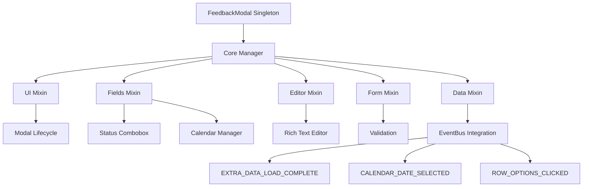
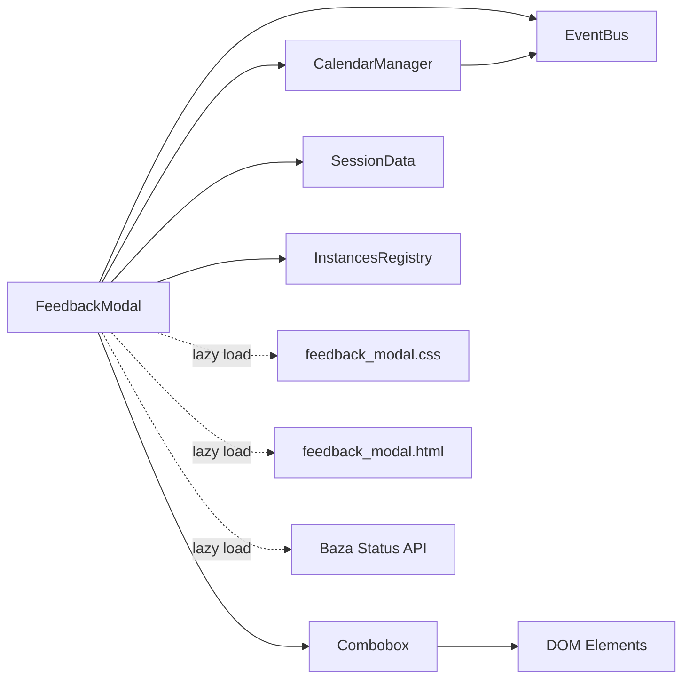
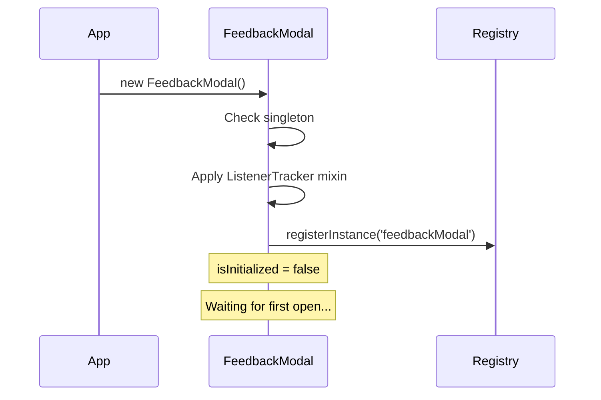
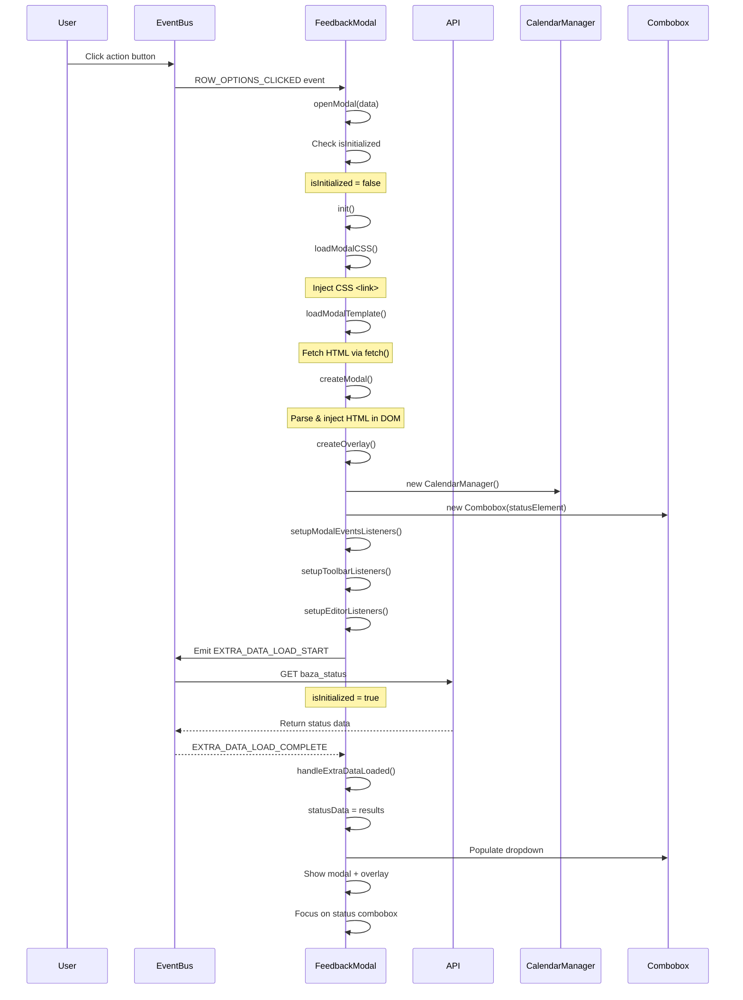
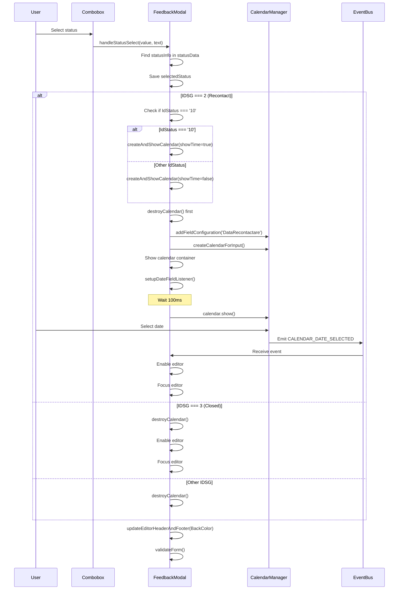
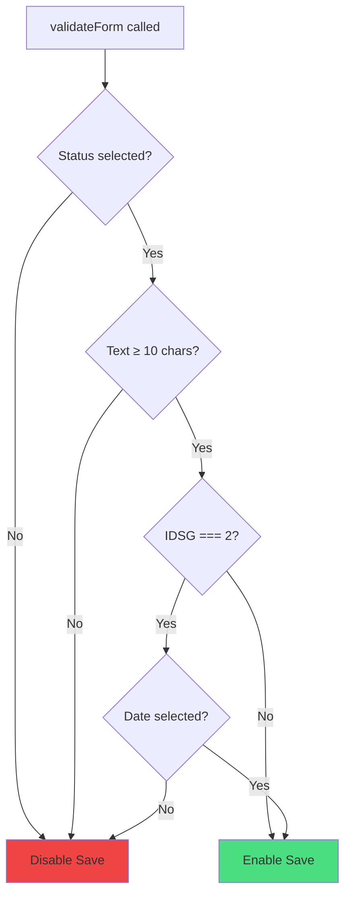
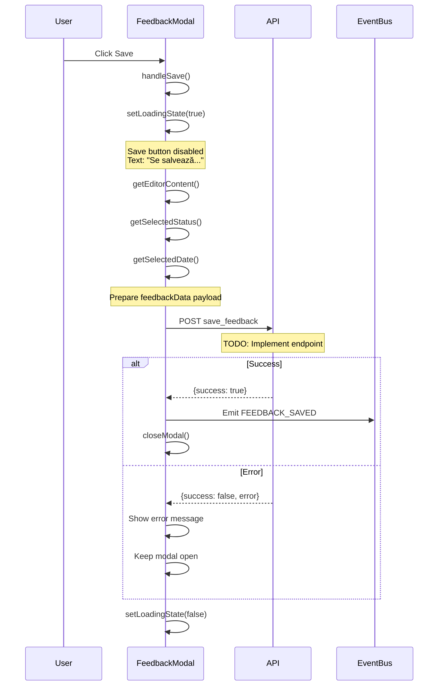
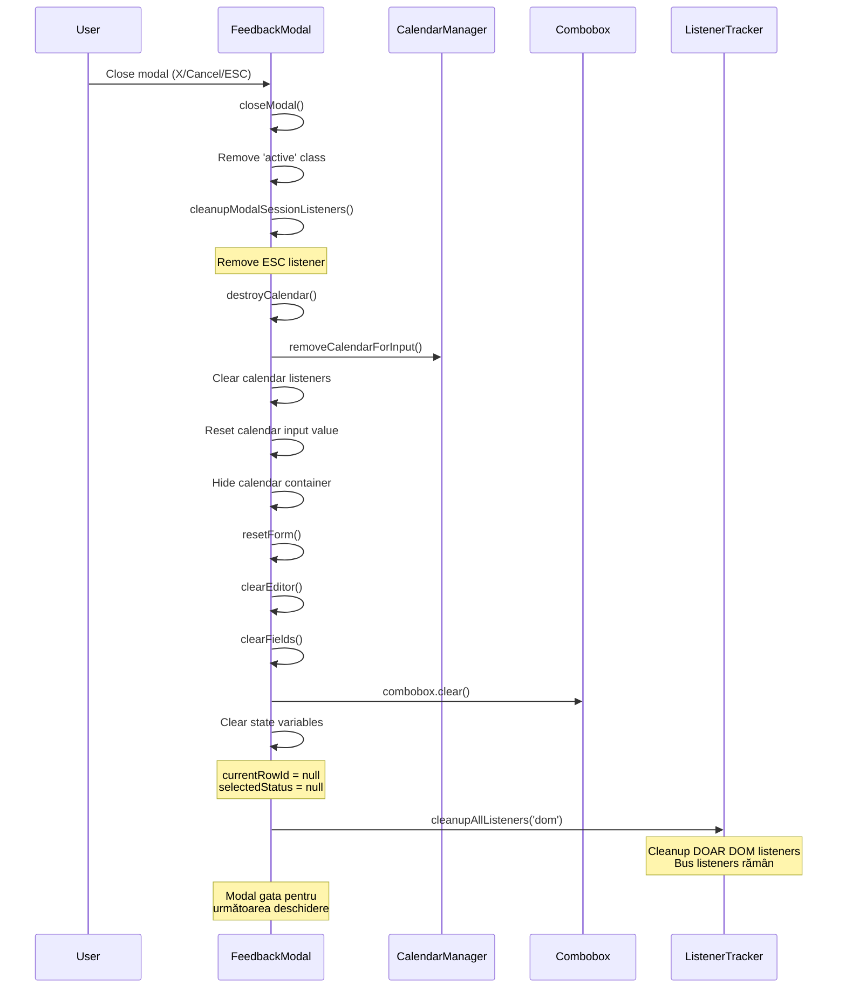
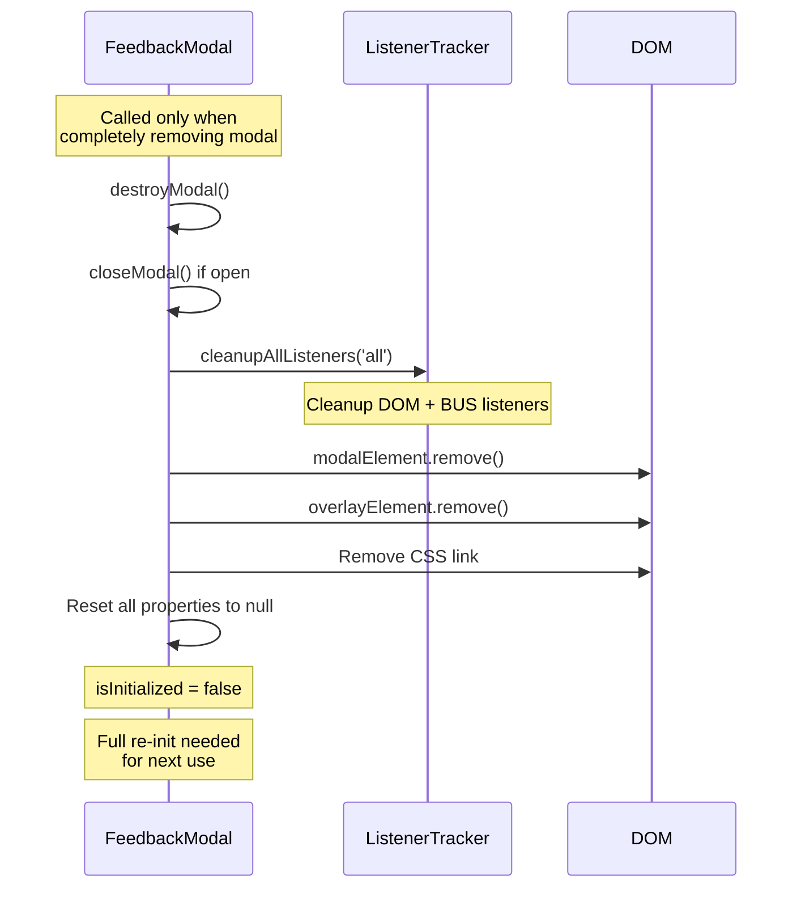
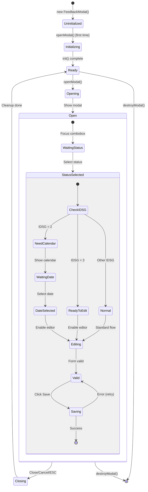

# Feedback Modal System - Comprehensive Documentation

**Version:** 2.0.0  
**Author:** Adelina Trandafir - Avatar Soft SRL  
**Target Audience:** Internal Development Team (Adelina & Claude)

---

## Table of Contents

1. [System Overview](#system-overview)
2. [Architecture Deep Dive](#architecture-deep-dive)
3. [Component Breakdown](#component-breakdown)
4. [Complete Flow Documentation](#complete-flow-documentation)
5. [API Reference](#api-reference)
6. [State Management](#state-management)
7. [Integration Points](#integration-points)
8. [Troubleshooting](#troubleshooting)

---

## System Overview

### Purpose

Modal complet pentru adăugarea de feedback la clienți, cu:

- Selecție status dinamic (combobox cu căutare)
- Calendar condiționat (apare doar pentru status-uri IDSG=2)
- Rich text editor cu toolbar formatare
- Validare dinamică formular
- Lazy loading complet (CSS + HTML + Date)

### Key Features

- **Singleton Pattern** - O singură instanță globală
- **Lazy Initialization** - Se încarcă doar la prima deschidere
- **Mixin Architecture** - Funcționalitate împărțită în module logice
- **Event-Driven** - Comunicare prin EventBus
- **Smart Cleanup** - Gestionare automată listeners și resurse
- **Dynamic Calendar** - Se creează/distruge în funcție de status selectat

### Technology Stack

- **Pure JavaScript** (ES6+)
- **EventBus** - Custom event system
- **CalendarManager** - Internal calendar component
- **Combobox** - Internal dropdown with search
- **ListenerTracker Mixin** - Automated resource management

---

## Architecture Deep Dive

### High-Level Architecture



### Component Dependencies



### Mixin Architecture

**feedback-manager.js** (Core)

- Singleton instance
- Initialization orchestration
- Logger creation
- ListenerTracker integration
- Instance registration

**Mixins:**

1. **feedback-ui.js** - Modal lifecycle (open/close/destroy)
2. **feedback-fields.js** - Status combobox + Calendar management
3. **feedback-editor.js** - Rich text editor + toolbar
4. **feedback-form.js** - Form validation + reset
5. **feedback-data.js** - EventBus integration + data handling

---

## Component Breakdown

### 1. Core Manager (feedback-manager.js)

**Responsibilities:**

- Singleton enforcement
- Lazy initialization orchestration
- Mixin composition
- Global logger creation
- Instance registration

**Key Properties:**

```javascript
isInitialized: boolean; // Lazy loading flag
currentRowId: number | null; // Active client row ID
statusData: Array; // Cached status options from server
selectedStatus: Object | null; // Currently selected status details
calendarManager: CalendarManager; // Calendar instance
statusCombobox: Combobox; // Status dropdown instance
editorContent: string; // Current editor HTML
spellCheckBannerDismissed: boolean; // User preference
```

**DOM Element References:**

```javascript
modalElement; // Main modal container
overlayElement; // Background overlay
modalHeaderElement; // Header section
modalFooterElement; // Footer section
feedbackElement; // ContentEditable editor
saveBtnElement; // Save button
counterElement; // Character counter
cancelBtnElement; // Cancel button
closeBtnElement; // Close (X) button
toolBarElement; // Editor toolbar
colorPickerElement; // Color picker input
statusElement; // Status combobox container
dateElement; // Date field container
calendarElement; // Calendar input element
calendarContainerElement; // Calendar wrapper div
```

**Initialization Flow:**

1. Check if already initialized (`isInitialized` flag)
2. Load CSS dynamically (`loadModalCSS()`)
3. Load HTML template (`loadModalTemplate()`)
4. Create overlay in DOM
5. Parse and inject HTML
6. Cache all DOM references
7. Initialize CalendarManager
8. Initialize Status Combobox
9. Setup all event listeners
10. Load status data from server
11. Set `isInitialized = true`

---

### 2. UI Mixin (feedback-ui.js)

**Purpose:** Gestionează lifecycle-ul complet al modalului.

**Key Methods:**

#### `openModal(data)`

**Trigger:** `ROW_OPTIONS_CLICKED` event cu `rowAction: 'feedback'`

**Flow:**

1. Extrage `rowId` din event data
2. Verifică dacă modal e inițializat, dacă nu → `init()`
3. Salvează `currentRowId`
4. Setup session listeners (ESC key, etc.)
5. Populează status dropdown (dacă datele sunt deja încărcate)
6. Reset form complet
7. Show modal + overlay (add class `active`)
8. Check spell checker și arată banner dacă e cazul
9. Focus pe status combobox input

#### `closeModal()`

**Triggers:** Cancel button, Close (X) button, ESC key, Overlay click

**Flow:**

1. Verifică dacă modal e deschis (`isModalOpen()`)
2. Remove class `active` de pe modal + overlay
3. Cleanup session listeners (ESC key listener)
4. Distruge calendar complet (`destroyCalendar()`)
5. Reset form complet (`resetForm()`)
6. Clear variabile state (`currentRowId`, `selectedStatus`)
7. Cleanup **doar DOM listeners** (bus listeners rămân pentru refolosire)

#### `destroyModal()`

**Purpose:** Distrugere TOTALĂ a modalului (folosit rar, pentru cleanup complet)

**Flow:**

1. Close modal dacă e deschis
2. Cleanup **ALL** listeners (DOM + BUS)
3. Remove modal element din DOM
4. Remove overlay element din DOM
5. Remove CSS link din `<head>`
6. Reset toate proprietățile la null
7. Set `isInitialized = false`

#### `isModalOpen()`

**Returns:** `boolean` - true dacă modal are class `active`

#### `setupModalSessionListeners()`

Configurează listeners specifici sesiunii curente:

- ESC key pentru închidere
- Alți listeners temporari

#### `cleanupModalSessionListeners()`

Curăță listeners de sesiune la închidere modal.

---

### 3. Fields Mixin (feedback-fields.js)

**Purpose:** Gestionează câmpurile interactive (Status Combobox + Calendar).

**Key Methods:**

#### `loadStatusData()`

**Trigger:** La inițializare
**Flow:**

1. Preia `Department` din `sessionData`
2. Emit `EXTRA_DATA_LOAD_START` event cu:
   - `endpoint: 'get_baza_status'`
   - `requestType: 'baza_status'`
   - `department: <user_department>`
   - `cache: true`
3. Așteaptă răspuns prin `EXTRA_DATA_LOAD_COMPLETE`

#### `handleExtraDataLoaded(eventData)`

**Trigger:** `EXTRA_DATA_LOAD_COMPLETE` event
**Flow:**

1. Verifică `requestType === 'baza_status'`
2. Salvează `receivedData.results` în `this.statusData`
3. Dacă modal e deschis → call `populateStatusDropdown()`

#### `initializeStatusCombobox()`

**Called:** La init
**Flow:**

1. Găsește container `#feedback-status-container`
2. Creează instanță `new Combobox()` cu:
   - `placeholder: 'Selectează status...'`
   - `readonly: true`
   - `staticData: []` (populat mai târziu)
   - `onSelect: handleStatusSelect`
3. Override `renderResults` pentru a adăuga culori custom pe hover

#### `populateStatusDropdown()`

**Called:** Când `statusData` e disponibil și modal e deschis
**Flow:**

1. Verifică dacă `statusData` există și nu e gol
2. Transformă `statusData` în format Combobox:
   ```javascript
   {
     value: IdStatus,
     label: FelStatus,
     ...status  // toate proprietățile
   }
   ```
3. Setează `onSearch` pentru filtrare locală
4. Override `renderResults` pentru a aplica `BackColor` pe hover

#### `handleStatusSelect(value, text, data)`

**Trigger:** User selectează status din combobox

**Critical Flow:**

1. **Anulează operații anterioare**: Clear `_pendingCalendarOperation` timeout
2. Dacă `value` e null/empty:
   - Clear `selectedStatus`
   - Destroy calendar
   - Reset header/footer color la alb
   - Enable editor
   - Return
3. Găsește `statusInfo` în `statusData` după `IdStatus`
4. Salvează în `selectedStatus`:
   ```javascript
   {
     IdStatus: number,
     FelStatus: string,
     IDSG: number,      // CRITICAL pentru logica calendar
     BackColor: string,
     TipStatus: string
   }
   ```
5. Update header/footer background cu `BackColor`
6. **Decision Tree pe IDSG:**
   - **IDSG === 2**: Call `createAndShowCalendar(showTime)`
     - `showTime = true` dacă `IdStatus === '10'`
     - `showTime = false` pentru alte IdStatus
   - **IDSG === 3**:
     - Destroy calendar
     - Enable editor
     - Focus pe editor
   - **Altfel**:
     - Destroy calendar
7. Call `validateForm()`

#### `createAndShowCalendar(showTime = false)`

**Purpose:** Creează și afișează calendarul condiționat

**Flow:**

1. Log `showTime` parameter
2. Destroy calendar existent (`destroyCalendar()`)
3. Configurează `dateConfig`:
   ```javascript
   {
     defaultTime: '09:00',
     timeStep: 15,
     minTime: '07:00',
     maxTime: '20:00',
     allowPast: false,
     customDate: !showTime,      // doar dată
     customDateTime: showTime,    // dată + oră
     allowWeekends: false
   }
   ```
4. Add field configuration în CalendarManager
5. Create calendar pentru `calendarElement`
6. Show calendar container (`display: block`)
7. Setup date field listener (`setupDateFieldListener()`)
8. **Deschide automat calendar** după 100ms timeout
9. Salvează timeout în `_pendingCalendarOperation` (pentru anulare)

#### `destroyCalendar()`

**Purpose:** Distruge COMPLET calendarul

**Critical Flow:**

1. Log "Distrug calendar complet"
2. **Anulează operații în curs**: Clear `_pendingCalendarOperation`
3. Clear date field listeners (`clearDateFieldListeners()`)
4. Dacă calendar există în CalendarManager:
   - Call `removeCalendarForInput(calendarElement)`
   - Handle errors defensive
5. Reset `calendarElement.value = ''`
6. Hide calendar container (`display: none`)
7. Log success

#### `setupDateFieldListener()`

**Purpose:** Ascultă după selecție dată în calendar

**Flow:**

1. Verifică defensiv dacă `calendarElement` există
2. Clear listeners anteriori
3. Add `CALENDAR_DATE_SELECTED` bus listener:
   - Verifică `fieldName === 'DataRecontactare'`
   - Verifică `instanceId` match cu calendarul curent
   - **Defensive check:** Verifică dacă calendar mai există în manager
   - Dacă validări pass:
     - Log "Data selectată"
     - Enable editor (`contentEditable = true`)
     - Focus pe editor
4. Salvează unsubscribe în `_dateSelectedUnsubscribe`

#### `clearDateFieldListeners()`

Execută `_dateSelectedUnsubscribe()` și setează la null.

#### `getSelectedStatus()`

**Returns:**

```javascript
{
  IdStatus: number,
  FelStatus: string,
  IDSG: number,
  BackColor: string,
  TipStatus: string
} | null
```

#### `getSelectedDate()`

**Returns:** `string | null`

**Validations:**

1. Verifică `selectedStatus.IDSG === 2` (calendar activ)
2. Verifică dacă `calendarElement` există
3. **Defensive:** Verifică dacă calendar există în CalendarManager
4. Preia `calendarElement.value.trim()`
5. Return value sau null

#### `clearFields()`

**Flow:**

1. Clear status combobox (`statusCombobox.clear()`)
2. Reset `selectedStatus = null`
3. Destroy calendar complet
4. Reset header/footer color la alb

---

### 4. Editor Mixin (feedback-editor.js)

**Purpose:** Gestionează rich text editor + toolbar formatare.

**Key Methods:**

#### `setupToolbarListeners()`

**Called:** La init
**Flow:**

1. Găsește toate `.feedback-toolbar-btn`
2. Add click listener pe fiecare:
   - Prevent default
   - Extrage `data-command` attribute
   - Execute `document.execCommand(command, false, null)`
   - **Focus pe editor** (NU pe toolbar button)
3. Setup color picker:
   - Listen `change` event
   - Execute `execCommand('foreColor', false, e.target.value)`
   - Focus pe editor

**Supported Commands:**

- `bold` - Bold text
- `italic` - Italic text
- `underline` - Underline text
- `insertUnorderedList` - Bullet list
- `foreColor` - Text color (via color picker)

#### `setupEditorListeners()`

Add `input` listener pe `feedbackElement` → call `handleEditorInput()`

#### `handleEditorInput()`

**Trigger:** Orice modificare în editor (typing, paste, format)
**Flow:**

1. Extrage `textContent` din editor
2. Calculează `charCount = text.trim().length`
3. Update `counterElement.textContent`
4. Log count
5. Call `validateForm()`

#### `checkSpellChecker()`

**Called:** La deschidere modal
**Flow:**

1. Verifică dacă banner e dismissed (`spellCheckBannerDismissed`)
2. Dacă nu:
   - Așteaptă 1000ms
   - Verifică `editor.spellcheck && navigator.language.includes('ro')`
   - Dacă spell check NU e disponibil → show banner

#### `dismissSpellCheckBanner()`

Hide banner + salvează preferință în localStorage.

#### `getEditorContent()`

**Returns:**

```javascript
{
  html: string,      // innerHTML complet
  text: string,      // textContent curat (trim)
  charCount: number  // lungime text curat
}
```

#### `clearEditor()`

**Flow:**

1. Set `feedbackElement.innerHTML = ''`
2. Set `contentEditable = 'true'`
3. Reset `counterElement = '0'`
4. Clear `editorContent` property

#### `setEditorEditable(enabled: boolean)`

**Flow:**

1. Set `contentEditable = enabled ? 'true' : 'false'`
2. Dacă enabled → focus pe editor
3. Dacă disabled → blur editor

#### `updateEditorHeaderAndFooter(color: string)`

**Purpose:** Schimbă culoarea header + footer cu gradient smooth

**Flow:**

1. Parse HEX color → RGB
2. Construiește gradient:
   ```css
   linear-gradient(to right,
     #ffffff 0%,
     <color> 40%,
     <color> 80%,
     #ffffff 100%)
   ```
3. Aplică pe `modalHeaderElement` și `modalFooterElement`
4. Set text color la negru

#### `updateEditorHeaderAndFooterDark(color: string)`

**Alternative:** Gradient dark (culoare întunecat → culoare normală)

---

### 5. Form Mixin (feedback-form.js)

**Purpose:** Validare și reset formular.

**Key Methods:**

#### `resetForm()`

**Flow:**

1. Call `clearEditor()`
2. Call `clearFields()` (status + calendar)
3. Call `validateForm()` (va dezactiva Save button)

#### `validateForm()`

**Purpose:** Validează complet formularul și activează/dezactivează Save button

**Validation Rules:**

```javascript
1. hasValidStatus = statusCombobox.getSelectedValue() !== ''
2. hasValidText = editor.textContent.trim().length >= 10
3. hasValidDate =
   - true (dacă status.IDSG !== 2)
   - calendarElement.value.trim() !== '' (dacă status.IDSG === 2)

isValid = hasValidStatus && hasValidText && hasValidDate
```

**Flow:**

1. Extrage text din editor
2. Verifică status selectat
3. Verifică lungime text ≥ 10
4. Verifică dată (doar dacă calendar e activ)
5. Combine toate validările
6. Set `saveBtn.disabled = !isValid`

---

### 6. Data Mixin (feedback-data.js)

**Purpose:** Integrare cu backend și EventBus.

**Key Methods:**

#### `handleExtraDataLoaded(eventData)`

**Trigger:** `EXTRA_DATA_LOAD_COMPLETE` event
**Duplicate:** Vezi Fields Mixin pentru implementare completă

#### `handleSave()`

**Trigger:** Click pe Save button

**Flow:**

1. Log "Salvez feedback..."
2. Set loading state (`setLoadingState(true)`)
3. Colectează date:
   ```javascript
   {
     rowId: currentRowId,
     IdStatus: selectedStatus.IdStatus,
     FelStatus: selectedStatus.FelStatus,
     feedback: editorContent.html,
     feedbackText: editorContent.text,
     dataRecontactare: selectedDate
   }
   ```
4. **TODO:** Emit save event către backend
5. **TODO:** Handle response
6. În `finally`: Set loading state false

#### `setLoadingState(loading: boolean)`

**Flow:**

1. Dacă loading:
   - Salvează text original în `data-originalText`
   - Disable button
   - Change text → "💾 Se salvează..."
   - Add class `loading`
2. Altfel:
   - Restore text original
   - Enable button
   - Remove class `loading`

---

## Complete Flow Documentation

### Flow 1: Initial Application Load



**Detalii:**

- Modal NU se inițializează la load
- Se creează doar instanța singleton
- Se aplică ListenerTracker pentru resource management
- Se înregistrează în InstancesRegistry
- **Niciun DOM manipulation, niciun CSS load**

---

### Flow 2: First Modal Open (Lazy Initialization)



**Timing Critical Points:**

1. CSS load trebuie completat înainte de HTML inject
2. DOM elements trebuie cached după HTML inject
3. CalendarManager init după DOM ready
4. Status data poate veni async după modal e deschis

---

### Flow 3: Status Selection → Calendar Show/Hide



**Critical Decision Tree:**

- **IDSG = 2**: Status care necesită recontact
  - Crează calendar
  - Dacă `IdStatus=10` → cu oră
  - Altfel → doar dată
  - Editor DISABLED până se selectează data
- **IDSG = 3**: Status de închidere
  - Destroy calendar
  - Editor ENABLED imediat
- **Other IDSG**: Status normal
  - Destroy calendar
  - Nicio acțiune specială

---

### Flow 4: Form Validation Logic



**Triggers pentru validateForm():**

- `handleEditorInput()` - la orice modificare în editor
- `handleStatusSelect()` - la selectare status
- Date selected event (indirect, prin editor enable)
- `resetForm()` - la reset complet

**Validation State:**

```javascript
Save Button Enabled =
  hasValidStatus &&
  hasValidText &&
  (IDSG !== 2 || hasValidDate)
```

---

### Flow 5: Save Flow (TODO - Backend Integration)



---

### Flow 6: Modal Close & Cleanup



**Important:**

- **NU se distruge modalul complet**
- Se păstrează în DOM pentru refolosire
- Se cleanup doar DOM listeners
- Bus listeners rămân active (EXTRA_DATA_LOAD_COMPLETE, etc.)
- Calendar se distruge complet (va fi recreat la nevoie)

---

### Flow 7: Complete Destroy (Rare)



---

## State Management

### Application State

```javascript
FeedbackModal State Machine:

┌─────────────────────────────────────────────────┐
│                                                 │
│  UNINITIALIZED                                  │
│  - isInitialized: false                         │
│  - No DOM elements                              │
│  - No event listeners                           │
│                                                 │
└────────────────┬────────────────────────────────┘
                 │
                 │ First openModal()
                 │
                 ▼
┌─────────────────────────────────────────────────┐
│                                                 │
│  INITIALIZING (async)                           │
│  - Loading CSS                                  │
│  - Loading HTML                                 │
│  - Creating DOM elements                        │
│  - Loading status data                          │
│                                                 │
└────────────────┬────────────────────────────────┘
                 │
                 │ init() complete
                 │
                 ▼
┌─────────────────────────────────────────────────┐
│                                                 │
│  READY (Closed)                                 │
│  - isInitialized: true                          │
│  - Modal in DOM but hidden                      │
│  - Bus listeners active                         │
│  - Waiting for open                             │
│                                                 │
└────────┬────────────────────────────────────────┘
         │                    ▲
         │ openModal()        │ closeModal()
         ▼                    │
┌─────────────────────────────┴───────────────────┐
│                                                 │
│  OPEN                                           │
│  - Modal visible                                │
│  - currentRowId set                             │
│  - All listeners active                         │
│                                                 │
│  ┌──────────────────────────────────────────┐  │
│  │  Sub-states:                             │  │
│  │  - WAITING_STATUS (initial)              │  │
│  │  - STATUS_SELECTED                       │  │
│  │    ├─ WAITING_DATE (if IDSG=2)          │  │
│  │    ├─ READY_TO_EDIT (if IDSG=3)         │  │
│  │    └─ NORMAL (other IDSG)               │  │
│  │  - DATE_SELECTED (calendar dismissed)    │  │
│  │  - EDITING                               │  │
│  │  - VALID (can save)                      │  │
│  │  - SAVING (loading state)                │  │
│  └──────────────────────────────────────────┘  │
│                                                 │
└─────────────────────────────────────────────────┘
         │
         │ destroyModal()
         ▼
┌─────────────────────────────────────────────────┐
│                                                 │
│  DESTROYED                                      │
│  - Back to UNINITIALIZED                        │
│  - All resources released                       │
│                                                 │
└─────────────────────────────────────────────────┘
```

### Form State

```javascript
Form Validation State:

┌──────────────────────────────────────────┐
│                                          │
│  INVALID                                 │
│  - Save button disabled                  │
│  - Missing required fields               │
│                                          │
└──────────────┬───────────────────────────┘
               │
               │ All validations pass
               ▼
┌──────────────────────────────────────────┐
│                                          │
│  VALID                                   │
│  - Save button enabled                   │
│  - All fields complete                   │
│                                          │
└──────────────┬───────────────────────────┘
               │
               │ Click Save
               ▼
┌──────────────────────────────────────────┐
│                                          │
│  SAVING                                  │
│  - Loading state active                  │
│  - All inputs disabled                   │
│  - Waiting API response                  │
│                                          │
└──────────────┬───────────────────────────┘
               │
               ├─ Success → CLOSED
               └─ Error → VALID (retry)
```

### Calendar State

```javascript
Calendar Lifecycle:

NULL (No calendar)
    │
    │ Status with IDSG=2 selected
    ▼
CREATING
    │
    ├─ Destroy existing calendar
    ├─ Configure dateConfig
    ├─ Add field to CalendarManager
    ├─ Create calendar instance
    ├─ Show container
    └─ Setup listeners
    │
    ▼
VISIBLE (Calendar shown)
    │
    │ User selects date
    ▼
DATE_SELECTED
    │
    ├─ Enable editor
    └─ Calendar remains visible
    │
    │ Status changed OR modal closed
    ▼
DESTROYING
    │
    ├─ Clear pending operations
    ├─ Clear listeners
    ├─ Remove from CalendarManager
    ├─ Reset input value
    └─ Hide container
    │
    ▼
NULL (Back to initial state)
```

---

## API Reference

### Core Methods

#### `new FeedbackModal()`

**Singleton constructor**

- Returns existing instance if already created
- Applies mixins
- Registers in InstancesRegistry
- Does NOT initialize (lazy)

#### `async init()`

**Lazy initialization**

- Loads CSS dynamically
- Loads HTML template
- Creates modal + overlay in DOM
- Initializes dependencies (CalendarManager, Combobox)
- Sets up all event listeners
- Loads status data from API
- **Can only be called once**

**Throws:** Error if CSS/HTML load fails

#### `async openModal(data: Object)`

**Opens modal for specific row**

**Parameters:**

```javascript
{
  data: {
    rowId: number,
    rowAction: 'feedback'  // MUST be 'feedback'
  }
}
```

**Flow:**

- Initializes if needed
- Sets `currentRowId`
- Resets form
- Shows modal
- Focuses status combobox

#### `closeModal()`

**Closes modal with cleanup**

- Hides modal + overlay
- Destroys calendar
- Clears form
- Cleanup DOM listeners (NOT bus listeners)
- Resets state variables

#### `destroyModal()`

**Complete destruction**

- Closes modal
- Cleanup ALL listeners (DOM + BUS)
- Removes from DOM
- Removes CSS
- Resets to uninitialized state

**Warning:** Requires full re-init for next use

#### `isModalOpen(): boolean`

**Check modal state**

**Returns:** `true` if modal has class `active`

---

### Form Methods

#### `resetForm()`

**Complete form reset**

- Clears editor
- Clears all fields (status + calendar)
- Runs validation (disables Save button)

#### `validateForm()`

**Validates entire form**

**Validation Logic:**

1. Check status selected
2. Check text length ≥ 10
3. If IDSG=2, check date selected
4. Enable/disable Save button

**Called by:**

- `handleEditorInput()`
- `handleStatusSelect()`
- `resetForm()`

---

### Field Methods

#### `loadStatusData()`

**Fetches status options from API**

- Gets department from sessionData
- Emits `EXTRA_DATA_LOAD_START` event
- Waits for `EXTRA_DATA_LOAD_COMPLETE`

#### `populateStatusDropdown()`

**Populates combobox with status data**

- Requires `statusData` loaded
- Formats for Combobox
- Sets up search function
- Applies custom colors

#### `handleStatusSelect(value, text)`

**Handles status selection**

**Parameters:**

- `value: string` - IdStatus
- `text: string` - FelStatus label

**Logic:**

- Saves `selectedStatus` object
- Updates header/footer color
- Shows/hides calendar based on IDSG
- Validates form

#### `createAndShowCalendar(showTime: boolean)`

**Creates calendar conditionally**

**Parameters:**

- `showTime: boolean` - true pentru date+time, false doar date

**Flow:**

- Destroys existing calendar
- Configures date settings
- Creates calendar instance
- Shows container
- Auto-opens calendar after 100ms

#### `destroyCalendar()`

**Complete calendar destruction**

- Cancels pending operations
- Clears listeners
- Removes from CalendarManager
- Hides container
- Resets input

**Critical:** Called on status change or modal close

#### `getSelectedStatus(): Object | null`

**Returns selected status details**

**Returns:**

```javascript
{
  IdStatus: number,
  FelStatus: string,
  IDSG: number,
  BackColor: string,
  TipStatus: string
} | null
```

#### `getSelectedDate(): string | null`

**Returns selected date from calendar**

**Validation:**

- Only if IDSG=2
- Only if calendar exists
- Only if value not empty

**Returns:** Date string in calendar format or null

---

### Editor Methods

#### `getEditorContent(): Object`

**Extracts editor content**

**Returns:**

```javascript
{
  html: string,      // Full HTML
  text: string,      // Clean text
  charCount: number  // Character count
}
```

#### `clearEditor()`

**Clears editor completely**

- Resets innerHTML
- Enables editing
- Resets counter

#### `setEditorEditable(enabled: boolean)`

**Controls editor state**

- Sets contentEditable
- Focuses/blurs editor

#### `updateEditorHeaderAndFooter(color: string)`

**Updates modal colors**

**Parameters:**

- `color: string` - HEX color (e.g., '#FF5733')

**Effect:**

- Creates smooth gradient
- Applies to header + footer
- Sets text color to black

---

### Data Methods

#### `handleSave()`

**Saves feedback (TODO: Backend)**

**Current Flow:**

1. Sets loading state
2. Collects all form data
3. TODO: API call
4. TODO: Success/error handling
5. Clears loading state

**Collected Data:**

```javascript
{
  rowId: number,
  IdStatus: number,
  FelStatus: string,
  feedback: string,        // HTML
  feedbackText: string,    // Plain text
  dataRecontactare: string | null
}
```

#### `setLoadingState(loading: boolean)`

**Controls Save button loading state**

**When loading=true:**

- Disables button
- Changes text to "Se salvează..."
- Adds loading class

**When loading=false:**

- Restores original text
- Enables button
- Removes loading class

---

### UI Helper Methods

#### `setupModalSessionListeners()`

**Sets up temporary listeners**

- ESC key listener
- Other session-specific listeners

**Called:** At modal open

#### `cleanupModalSessionListeners()`

**Removes temporary listeners**

**Called:** At modal close

#### `setupToolbarListeners()`

**Sets up editor toolbar**

- Bold, Italic, Underline buttons
- Color picker
- List button

#### `setupEditorListeners()`

**Sets up editor input handling**

- Monitors content changes
- Updates character counter
- Triggers validation

#### `checkSpellChecker()`

**Checks Romanian spell check availability**

- Shows banner if unavailable
- Respects user preference (dismissed)

#### `dismissSpellCheckBanner()`

**Hides spell check banner**

- Saves preference to localStorage

---

## Integration Points

### Dependencies (Internal)

#### EventBus

**Events Consumed:**

- `ROW_OPTIONS_CLICKED` - Trigger modal open
- `EXTRA_DATA_LOAD_COMPLETE` - Receive status data
- `CALENDAR_DATE_SELECTED` - Calendar date selection

**Events Emitted:**

- `EXTRA_DATA_LOAD_START` - Request status data
- TODO: `FEEDBACK_SAVED` - After successful save

#### CalendarManager

**Usage:**

- `addFieldConfiguration()` - Configure calendar
- `createCalendarForInput()` - Create instance
- `removeCalendarForInput()` - Destroy instance
- `calendars.get(id)` - Access calendar instance

**Lifecycle:**

- Created once at init
- Calendars created/destroyed dynamically
- Never destroyed (persists with modal)

#### Combobox

**Usage:**

- `new Combobox(container, options)` - Initialize
- `clear()` - Reset selection
- `getSelectedValue()` - Get current value

**Configuration:**

```javascript
{
  placeholder: string,
  readonly: boolean,
  staticData: Array,
  onSelect: Function,
  onSearch: Function
}
```

#### SessionData

**Usage:**

- `get('Department')` - Get user department for API calls

#### InstancesRegistry

**Usage:**

- `registerInstance(name, instance, metadata)` - Register on init

---

### External Files

#### CSS: feedback_modal.css

**Loaded:** Dynamically via `<link>` at first init
**Location:** `/static/css/feedback_modal.css`
**Key Classes:**

- `.feedback-modal-overlay` - Main container
- `.feedback-modal-container` - Inner modal
- `.feedback-editor` - Rich text editor
- `.feedback-toolbar-btn` - Toolbar buttons
- `.spell-check-banner` - Info banner

#### HTML: feedback_modal.html

**Loaded:** Via `fetch()` at first init
**Location:** `/static/html/feedback_modal.html`
**Structure:**

```html
<div class="feedback-modal-container">
  <div class="feedback-modal-header">...</div>
  <div class="feedback-modal-body">
    <div id="feedback-status-container"></div>
    <div id="g_DataRecontactare">
      <input id="DataRecontactare" />
    </div>
    <div class="feedback-toolbar">...</div>
    <div id="feedback-editor" contenteditable></div>
  </div>
  <div class="feedback-modal-footer">...</div>
</div>
```

---

## Troubleshooting

### Common Issues

#### Modal nu se deschide

**Verificări:**

1. Check `isInitialized` flag
2. Check `modalElement` exists in DOM
3. Check `overlayElement` exists in DOM
4. Verify `ROW_OPTIONS_CLICKED` event cu `rowAction='feedback'`
5. Check console pentru erori de inițializare

**Debug:**

```javascript
window.feedbackModal.isInitialized; // Should be true after first open
window.feedbackModal.modalElement; // Should be <div> element
window.feedbackModal.isModalOpen(); // Check current state
```

#### Calendar nu apare

**Verificări:**

1. Check `selectedStatus.IDSG === 2`
2. Check `calendarElement` exists
3. Check `calendarContainerElement.style.display !== 'none'`
4. Verify calendar în CalendarManager:
   ```javascript
   window.feedbackModal.calendarManager.calendars.has('DataRecontactare');
   ```

**Common Causes:**

- Status cu IDSG diferit de 2
- Calendar nu a fost creat (eroare în `createAndShowCalendar()`)
- Timeout anulat prematur

#### Save button rămâne disabled

**Verificări:**

1. Status selectat?
   ```javascript
   window.feedbackModal.statusCombobox.getSelectedValue();
   ```
2. Text length ≥ 10?
   ```javascript
   window.feedbackModal.feedbackElement.textContent.trim().length;
   ```
3. Dacă IDSG=2, dată selectată?
   ```javascript
   window.feedbackModal.calendarElement.value;
   ```

**Force validate:**

```javascript
window.feedbackModal.validateForm();
```

#### Memory Leaks / Listeners nu se curăță

**Diagnostic:**

```javascript
// Check toate instanțele tracked
debugAllListeners();

// Check specific FeedbackModal
window.feedbackModal.getListenerStats();

// Force cleanup
window.feedbackModal.cleanupAllListeners('all');
```

**Prevention:**

- Asigură-te că `closeModal()` e apelat corect
- Nu apela `openModal()` multiplu fără `closeModal()`
- Folosește `destroyModal()` când modal nu mai e necesar

#### Calendar rămâne după schimbarea status-ului

**Cause:** `destroyCalendar()` nu e apelat corect

**Fix:**

- Verifică că `handleStatusSelect()` apelează `destroyCalendar()` pentru IDSG ≠ 2
- Check `_pendingCalendarOperation` timeout e anulat

**Manual destroy:**

```javascript
window.feedbackModal.destroyCalendar();
```

#### Status data nu se încarcă

**Verificări:**

1. Department setat în sessionData?
   ```javascript
   sessionData.get('Department');
   ```
2. API endpoint funcțional?
3. EventBus listener activ?
   ```javascript
   eventBus.listenerCount('extra-data-load-complete');
   ```

**Manual trigger:**

```javascript
window.feedbackModal.loadStatusData();
```

---

### Debug Tools

#### Global Functions (via ListenerTracker)

```javascript
// View all listeners
debugAllListeners();

// Cleanup all
cleanupAllListeners();

// Health check
checkAllListenersHealth();

// View stats
getAllListenerStats();
```

#### FeedbackModal Specific

```javascript
// Instance reference
window.feedbackModal;

// Check state
window.feedbackModal.isInitialized;
window.feedbackModal.currentRowId;
window.feedbackModal.selectedStatus;
window.feedbackModal.statusData;

// Manual operations
window.feedbackModal.openModal({ data: { rowId: 123, rowAction: 'feedback' } });
window.feedbackModal.closeModal();
window.feedbackModal.resetForm();
window.feedbackModal.validateForm();
```

#### EventBus Debugging

```javascript
// Check listeners
eventBus.listenerCount('extra-data-load-complete');
eventBus.listenerCount('calendar-date-selected');

// View history
eventBus.getHistory();

// Stats
eventBus.getStats();
```

---

## Lifecycle Diagram (Complete)



---

## Performance Considerations

### Lazy Loading Benefits

- **Initial Load:** ~0ms overhead (doar singleton create)
- **First Open:** ~200-400ms (CSS + HTML + Calendar init)
- **Subsequent Opens:** ~50-100ms (doar reset + show)

### Resource Management

- **CSS:** Loaded once, reused
- **HTML:** Loaded once, stays in DOM
- **Calendar:** Created/destroyed per-session
- **Listeners:** DOM cleaned per-session, Bus persists

### Memory Footprint

- **Closed Modal:** ~50KB (DOM elements + listeners)
- **Open Modal:** ~150KB (+ Calendar + Combobox instances)
- **Multiple Opens:** No memory leak (proper cleanup)

---

## Future Enhancements (TODO)

### Backend Integration

- [ ] Implement `handleSave()` API call
- [ ] Error handling și retry logic
- [ ] Success notification
- [ ] Loading states improvements

### Features

- [ ] Draft auto-save (localStorage)
- [ ] Rich text paste cleanup
- [ ] Attachment support
- [ ] Template feedback-uri predefinite
- [ ] History feedback-uri anterioare

### UX Improvements

- [ ] Keyboard shortcuts (Ctrl+S to save)
- [ ] Confirmation dialog la close cu date nesalvate
- [ ] Spell check integration nativă
- [ ] Mobile responsive improvements

### Performance

- [ ] Virtual scrolling pentru status list (dacă > 1000 items)
- [ ] Debounce validation
- [ ] Lazy calendar import

---

## Version History

**v2.0.0** (Current)

- Complete rewrite cu lazy loading
- Mixin architecture
- Calendar conditional integration
- Smart cleanup cu ListenerTracker

**v1.0.0**

- Initial implementation
- Basic modal functionality

---

**Document Generat:** Pentru uz intern (Adelina & Claude)  
**Ultima Actualizare:** 2025-01-10  
**Status:** Comprehensiv și up-to-date cu codul actual
