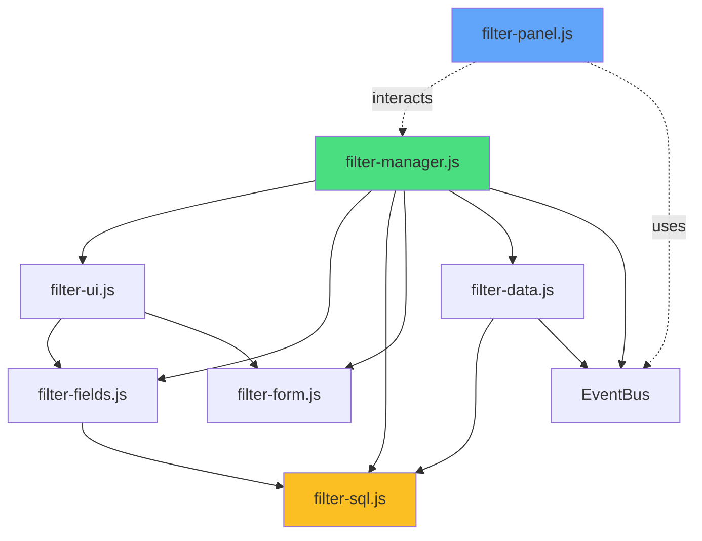
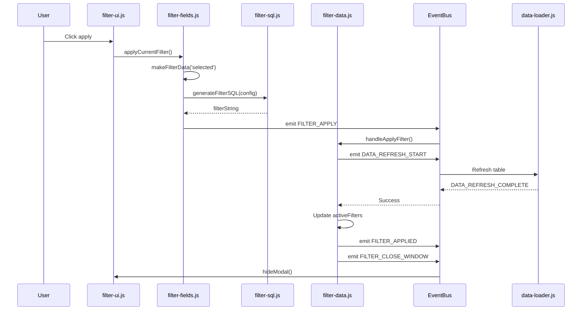
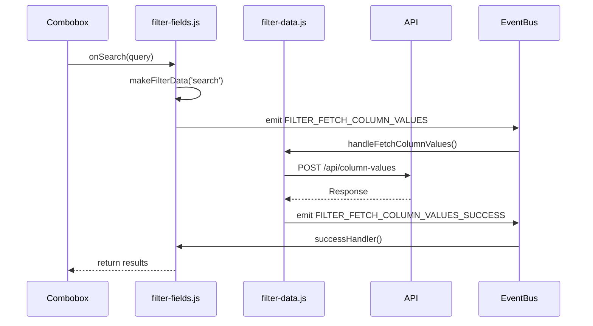

# 🔍 Filter System - Complete Documentation

**Version:** 4.0.0 - MODULAR ARCHITECTURE  
**Author:** Adelina Trandafir - Avatar Soft SRL  
**Architecture Pattern:** Mixin-based (after feedback-modal model)

---

## 📑 Table of Contents

1. [System Overview](#system-overview)
2. [Architecture](#architecture)
3. [Module Breakdown](#module-breakdown)
4. [API Reference](#api-reference)
5. [Event Flow](#event-flow)
6. [Migration Guide](#migration-guide)
7. [Usage Examples](#usage-examples)
8. [Troubleshooting](#troubleshooting)

---

## 🎯 System Overview

### Purpose

Sistem complet de filtrare modular pentru dashboard, construit după modelul `feedback-modal`:

- **Modular Architecture** - 7 fișiere separate după responsabilități
- **Mixin Pattern** - Compoziție în loc de moștenire
- **Pure SQL Functions** - Fără state în generarea SQL
- **Event-Driven** - Comunicare prin EventBus (păstrând doar evenimentele esențiale)
- **Zero Circular Dependencies** - Arhitectură clean

### Key Features

- ✅ **Singleton Pattern** - O singură instanță FilterManager
- ✅ **Lazy Initialization** - Se încarcă când e necesar
- ✅ **Mixin Composition** - 5 mixins pentru separarea responsabilităților
- ✅ **Pure SQL Functions** - Thread-safe, fără side effects
- ✅ **Smart Cleanup** - ListenerTracker pentru resource management
- ✅ **Panel Integration** - FilterPanel separat pentru sidebar

---

## 🏗️ Architecture

### High-Level Structure

```
📁 /static/js/filter-sorting/
├── 📄 filter-manager.js      (Core - 300 linii)
│   └── Singleton + Mixin composition + State management
│
├── 📄 filter-ui.js           (UI - 400 linii)
│   └── Modal lifecycle + Visuals + Accordion
│
├── 📄 filter-fields.js       (Fields - 300 linii)
│   └── Combobox + Field management + Validation
│
├── 📄 filter-sql.js          (SQL - 200 linii)
│   └── Pure SQL generation + Escaping + Validation
│
├── 📄 filter-form.js         (Form - 200 linii)
│   └── State + Form validation + Reset
│
├── 📄 filter-data.js         (Data - 200 linii)
│   └── API calls + Event handling + Data flow
│
├── 📄 filter-panel.js        (Panel - 400 linii)
│   └── Sidebar panel manager (SEPARAT de core)
│
├── 📄 filter-tooltip.js      (Tooltip - 50 linii)
│   └── Tooltip pentru filtre active (PĂSTRAT separat)
│
└── 📄 filter-README.md
    └── Documentație completă
```

### Dependency Graph



### Mixin Composition

```javascript
// filter-manager.js (Core)
class FilterManager {
  constructor() {
    // Apply ALL mixins
    Object.assign(this, filterUIMixin);
    Object.assign(this, filterFieldsMixin);
    Object.assign(this, filterSQLMixin);
    Object.assign(this, filterFormMixin);
    Object.assign(this, filterDataMixin);

    // Core state
    this.activeFilters = new Map();
    this.metrics = {...};
  }
}
```

---

## 📦 Module Breakdown

### 1. **filter-manager.js** (Core Orchestrator)

**Responsibilities:**

- ✅ Singleton enforcement
- ✅ Mixin composition
- ✅ Global state management (`activeFilters`)
- ✅ Metrics tracking
- ✅ Public API coordination
- ✅ Instance registration

**Key Properties:**

```javascript
isInitialized: boolean
activeFilters: Map<columnId, filterConfig>
filterHistory: Array
metrics: Object
```

**Public API:**

```javascript
async init()
getState()
destroy()
handleError(message, error)
```

**Delegates to Mixins:**

- `showModal()` → filter-ui.js
- `generateFilterSQL()` → filter-sql.js
- `handleApplyFilter()` → filter-data.js
- `resetForm()` → filter-form.js

---

### 2. **filter-ui.js** (Modal Lifecycle + Visuals)

**Responsibilities:**

- ✅ Modal open/close/animations
- ✅ Normal (inline) mode pentru sub-panels
- ✅ Visual updates (filter icons în header)
- ✅ Accordion behavior (exact/partial/range)
- ✅ Position management (sub header)

**Key Methods:**

```javascript
async showModal(data, source)
hideModal()
async showNormal(Data, source)
hideNormal(fieldName)
updateFilterVisual(columnId, isActive)
updateAllFilterVisuals()
initializeAccordionBasedOnType(columnType)
handleAccordionChange(selectedType)
positionModalUnderHeader(modal, th)
```

**DOM Elements Managed:**

```javascript
modalElement;
overlayElement;
injectedFilterDIV;
currentSource;
elementId;
className;
```

---

### 3. **filter-fields.js** (Combobox + Fields)

**Responsibilities:**

- ✅ Exact filter combobox (readonly/search)
- ✅ Static data loading pentru combobox
- ✅ Populate existing filter values
- ✅ Field validation și availability
- ✅ Request column values (API integration)

**Key Methods:**

```javascript
async initializeExactCombobox()
destroyExistingCombobox()
async getStaticDataForColumn()
async populateModalData(data)
async populateExactFilter(existingFilter)
async requestColumnValues(filterData)
makeFilterData(reason)
applyCurrentFilter()
clearCurrentFilter()
updateFilterOptionsAvailability(columnType)
```

**State:**

```javascript
exactCombobox: Combobox;
cbxSelectedValue: number;
useReadOnlyCbx: boolean;
isExactAvailable: boolean;
isPartialAvailable: boolean;
isRangeAvailable: boolean;
```

---

### 4. **filter-sql.js** (Pure SQL Functions)

**Responsibilities:**

- ✅ SQL generation pentru toate tipurile de filtre
- ✅ Validare configurații filtre
- ✅ Escaping SQL pentru siguranță
- ✅ Combinare filtre multiple
- ✅ Optimizări query

**Key Characteristics:**

- **Pure functions** (fără state)
- **Thread-safe** operations
- **SQL injection protection**
- **15+ operators** supported

**Key Methods:**

```javascript
generateFilterSQL(filterConfig) → string
combineFilters(filters, logicalOperator) → string
generateCompleteFilterSQL(activeFilters) → string
validateFilterConfig(filterConfig) → boolean
escapeFieldName(fieldName) → string
escapeValue(value, type) → string
escapeStringValue(str) → string
escapeLikeValue(value) → string
optimizeFilterSQL(sql) → string
isValidSQL(sql) → boolean
analyzeFilterSQL(sql) → Object
```

**Supported Operators:**

- Comparison: `=`, `!=`, `>`, `>=`, `<`, `<=`
- Text: `LIKE`, `NOT LIKE`, `starts_with`, `ends_with`
- Array: `IN`, `NOT IN`, `BETWEEN`
- Null: `IS NULL`, `IS NOT NULL`, `IS EMPTY`, `IS NOT EMPTY`

---

### 5. **filter-form.js** (State + Validation)

**Responsibilities:**

- ✅ State centralizat (modal + normal)
- ✅ Form validation
- ✅ Reset form
- ✅ Current column management
- ✅ Clear all filters

**State Structure:**

```javascript
modalState: {
  isOpen: boolean,
  currentColumn: string,
  currentField: string,
  currentType: string,
  currentFilterConfig: Object
}

normalState: {
  isVisible: boolean,
  currentColumn: string,
  currentField: string,
  currentType: string,
  currentFilterConfig: Object
}

// Shared state
currentColId: string
currentField: string
currentPK: string
currentModalData: Object
```

**Key Methods:**

```javascript
setCurrentColumn(id, field, PK, columnData);
resetForm();
validateForm();
clearAllFilters();
getModalState();
getNormalState();
getCurrentColumn();
handleModalOpen();
handleModalClose();
```

---

### 6. **filter-data.js** (API + Events)

**Responsibilities:**

- ✅ Setup event listeners
- ✅ Handle apply filter
- ✅ Handle clear filter
- ✅ Fetch column values (API)
- ✅ Event communication cu alte module

**Key Methods:**

```javascript
setupEventListeners()
async handleApplyFilter(receivedData)
async handleClearFilter(receivedData)
async handleFetchColumnValues(requestData)
```

**Events Handled:**

```javascript
// Listened
EVENTS.FILTER_APPLY;
EVENTS.FILTER_CLEAR;
EVENTS.FILTER_CLOSE_WINDOW;
EVENTS.FILTER_SHOW_WINDOW;
EVENTS.FILTER_FETCH_COLUMN_VALUES;

// Emitted
EVENTS.DATA_REFRESH_START;
EVENTS.FILTER_APPLIED;
EVENTS.FILTER_CLEARED;
EVENTS.FILTER_CLOSE_WINDOW;
EVENTS.FILTER_ERROR;
EVENTS.FILTER_FETCH_COLUMN_VALUES_SUCCESS;
EVENTS.FILTER_FETCH_COLUMN_VALUES_ERROR;
```

---

### 7. **filter-panel.js** (Panel Manager)

**Responsibilities:**

- ✅ Sidebar panel management (panel-dreapta)
- ✅ Display list of filterable columns
- ✅ Sync with table filter icons
- ✅ Sub-panel management
- ✅ Search functionality

**Key Features:**

- **Separate from core** - FilterPanel nu depinde de FilterManager
- **Event-driven** communication
- **ListenerTracker** integration
- **Singleton pattern**

**Key Methods:**

```javascript
init()
async onPanelOpened()
onPanelClosed()
async renderColumns()
handleRowClick(columnId, displayName)
performSearch(searchTerm)
updateColumnFilterStatus(columnData, hasFilter)
showSubPanel(columnElement, fieldName, displayName)
hideSubPanel()
```

---

## 📡 API Reference

### FilterManager (Public API)

#### `init(): Promise<boolean>`

Inițializează filter manager-ul complet.

```javascript
import filterManager from './filter-manager.js';
await filterManager.init();
```

#### `getState(): Object`

Returnează starea curentă completă.

```javascript
const state = filterManager.getState();
// {
//   isInitialized: true,
//   activeFiltersCount: 2,
//   modalState: {...},
//   metrics: {...},
//   historyCount: 15
// }
```

#### `destroy(): void`

Cleanup complet - toate listeners și resurse.

```javascript
filterManager.destroy();
```

---

### Modal Management

#### `showModal(data, source)`

Afișează modal floating pentru filtrare.

```javascript
filterManager.showModal(
  {
    data: {
      column: {
        id: 'NumeClient',
        field: 'NumeClient',
        PK: 'IdClient',
        type: 'varchar',
        readOnlyCbx: 0,
      },
    },
  },
  'table'
);
```

#### `hideModal()`

Închide modalul și face cleanup.

```javascript
filterManager.hideModal();
```

#### `showNormal(Data, source)`

Afișează filter inline în sub-panel.

```javascript
filterManager.showNormal({
  data: {
    columnData: {...},
    subPanel: subPanelElement
  }
}, 'filter-panel');
```

---

### SQL Generation

#### `generateFilterSQL(filterConfig): string`

Generează SQL pentru un filtru.

```javascript
const sql = filterManager.generateFilterSQL({
  field: 'NumeClient',
  operator: 'LIKE',
  value: 'SRL',
  type: 'text',
});
// "NumeClient LIKE '%SRL%'"
```

#### `combineFilters(filters, logicalOperator): string`

Combină multiple filtre.

```javascript
const sql = filterManager.combineFilters(
  [
    { field: 'NumeClient', operator: 'LIKE', value: 'SRL' },
    { field: 'Activ', operator: '=', value: 1 },
  ],
  'AND'
);
// "(NumeClient LIKE '%SRL%' AND Activ = 1)"
```

---

### Field Management

#### `applyCurrentFilter()`

Aplică filtrul curent din modal.

```javascript
filterManager.applyCurrentFilter();
```

#### `clearCurrentFilter()`

Șterge filtrul curent.

```javascript
filterManager.clearCurrentFilter();
```

#### `clearAllFilters()`

Șterge TOATE filtrele active.

```javascript
filterManager.clearAllFilters();
```

---

## 🔄 Event Flow

### Complete Filter Apply Flow



### Filter Fetch Values Flow



---

## 🔧 Migration Guide

### From Old Architecture to v4.0.0

#### Step 1: Replace Imports

**OLD:**

```javascript
import FilterManager from './filter-manager.js';
import FilterCore from './filter-core.js';
```

**NEW:**

```javascript
import filterManager from './filter-manager.js';
// filter-core.js NU MAI EXISTĂ
```

#### Step 2: Remove Event Listeners

**ELIMINATE (handled internally):**

```javascript
// ❌ NU MAI FOLOSI
eventBus.on(EVENTS.STRING_FILTER_CREATE_REQUEST, ...);
eventBus.on(EVENTS.STRING_FILTER_CREATE_SUCCESS, ...);
eventBus.on(EVENTS.STRING_FILTER_CREATE_ERROR, ...);
```

**PĂSTREAZĂ (external API):**

```javascript
// ✅ CONTINUĂ SĂ FOLOSEȘTI
eventBus.on(EVENTS.FILTER_APPLY, ...);
eventBus.on(EVENTS.FILTER_CLEAR, ...);
eventBus.on(EVENTS.FILTER_APPLIED, ...);
eventBus.on(EVENTS.FILTER_CLEARED, ...);
```

#### Step 3: Update Method Calls

**OLD:**

```javascript
filterCore.createFilterAsync(data);
filterCore.createFilterDirect(data);
```

**NEW:**

```javascript
filterManager.generateFilterSQL(data); // Direct, synchronous
```

#### Step 4: Update FilterPanel Import

**OLD:**

```javascript
import filterPanelManager from './filter-panel-manager.js';
```

**NEW:**

```javascript
import filterPanel from './filter-panel.js';
```

---

## 💡 Usage Examples

### Example 1: Initialize System

```javascript
import filterManager from './filter-sorting/filter-manager.js';
import filterPanel from './filter-sorting/filter-panel.js';

// Initialize
await filterManager.init();
filterPanel.init();
```

### Example 2: Open Filter Modal

```javascript
// From table header click
eventBus.emit(EVENTS.FILTER_SHOW_WINDOW, {
  columnData: {
    id: 'NumeClient',
    field: 'NumeClient',
    PK: 'IdClient',
    type: 'varchar',
    header: 'Nume Client',
    readOnlyCbx: 0,
  },
  source: 'table',
});
```

### Example 3: Generate SQL Directly

```javascript
const filterConfig = {
  field: 'NumeClient',
  operator: 'LIKE',
  value: 'SRL',
  type: 'text',
};

const sql = filterManager.generateFilterSQL(filterConfig);
console.log(sql); // "NumeClient LIKE '%SRL%'"
```

### Example 4: Listen for Filter Applied

```javascript
eventBus.on(EVENTS.FILTER_APPLIED, (columnData) => {
  console.log('Filter applied:', columnData);
  // Update UI accordingly
});
```

### Example 5: Clear All Filters

```javascript
filterManager.clearAllFilters();
```

---

## 🐛 Troubleshooting

### Issue: Modal nu se deschide

**Verificări:**

1. Check `filterManager.isInitialized`
2. Check DOM pentru `#filterWindow`
3. Verify event `FILTER_SHOW_WINDOW` cu structură corectă
4. Check console pentru erori de inițializare

**Debug:**

```javascript
filterManager.getState(); // Check initialization
filterManager.log('Test message'); // Enable debugMode
```

### Issue: SQL nu se generează corect

**Verificări:**

1. Validate `filterConfig` structure
2. Check operator name (case-insensitive)
3. Verify value type matches field type
4. Check escaping pentru caractere speciale

**Debug:**

```javascript
const isValid = filterManager.validateFilterConfig(config);
const analysis = filterManager.analyzeFilterSQL(sql);
```

### Issue: Combobox nu încarcă date

**Verificări:**

1. Check `requestColumnValues()` response
2. Verify API endpoint `/api/column-values`
3. Check `FILTER_FETCH_COLUMN_VALUES_SUCCESS` event
4. Inspect network tab pentru request/response

**Debug:**

```javascript
// Enable debugMode pentru verbose logging
filterManager.debugMode = true;
```

### Issue: Memory Leaks

**Verificări:**

1. Check `filterManager.cleanupAllListeners()`
2. Verify `destroy()` called la cleanup
3. Check pentru event listeners duplicați

**Debug:**

```javascript
// Get listener stats
filterManager.getListenerStats();

// Global debug
debugAllListeners();
```

---

## 📊 Performance Considerations

### Optimization Tips

1. **SQL Generation** - Pure functions, no overhead
2. **Event Bus** - Elimină evenimente inutile (v4.0.0)
3. **Combobox** - Lazy loading, debounced search
4. **Modal** - Singleton reuse, no recreation

### Memory Footprint

- **Closed State:** ~100KB (manager + panel)
- **Open Modal:** ~300KB (+ combobox instances)
- **Multiple Filters:** No memory leak (proper cleanup)

---

## 📈 Version History

### v4.0.0 (Current)

- ✅ Complete modular rewrite
- ✅ Mixin architecture (after feedback-modal)
- ✅ Eliminated circular dependencies
- ✅ Pure SQL functions
- ✅ FilterPanel separated from core
- ✅ Event-driven API simplified

### v3.0.0

- Previous monolithic architecture
- filter-core.js separate module
- More events, more complexity

---

## 🎯 Best Practices

### DO ✅

- Use `generateFilterSQL()` directly pentru SQL generation
- Listen for `FILTER_APPLIED` / `FILTER_CLEARED` pentru UI updates
- Call `destroy()` la cleanup complet
- Use `getState()` pentru debugging
- Enable `debugMode` pentru development

### DON'T ❌

- Nu accesa direct mixins (folosește API public)
- Nu emite events interne (`STRING_FILTER_CREATE_*`)
- Nu modifica `activeFilters` direct (folosește API)
- Nu creezi multiple instanțe (singleton pattern)
- Nu uita cleanup la destroy

---

**Document Version:** 4.0.0  
**Last Updated:** 2025-01-13  
**Status:** Production Ready ✅
